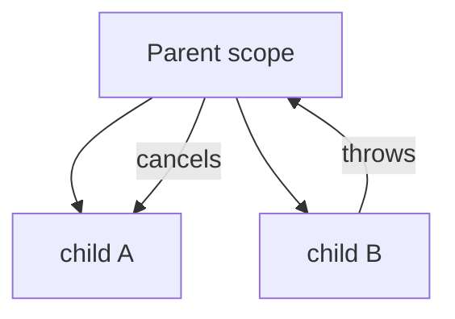

# 🌊 Coroutines & Flow

*Kotlin's structured, cancellable concurrency. Covers suspension, dispatchers, scopes, exceptions and cold vs hot streams.*

## ⏸️ What suspension is
<!-- related: tech-14, tech-154, tech-107 -->

- A coroutine is a resumable computation; `suspend` marks a function that can pause without blocking its thread.
- The compiler rewrites suspend functions into a **state machine** with a hidden `Continuation` parameter (CPS).
- Thousands of coroutines share a few threads — coroutines are cheap, threads are not.
- 📖 [developer.android.com/kotlin/coroutines](https://developer.android.com/kotlin/coroutines) — the official Android guide.

| | Thread | Coroutine |
|---|---|---|
| Scheduled by | OS (preemptive) | Dispatcher (cooperative) |
| Cost | ~1 MB stack | A few hundred bytes |
| Waiting | Parks the thread | Suspends; thread is freed |
| Cancellation | Interrupt, unreliable | Structured, cooperative |

## 🎛️ Dispatchers and scopes
<!-- related: tech-15, tech-89, tech-16 -->

### 🚦 Dispatchers

| Dispatcher | Pool | For |
|---|---|---|
| `Main` | UI thread | UI state updates |
| `IO` | Elastic (64+ threads) | Blocking disk/network |
| `Default` | = CPU cores | Parsing, sorting, image math |

### 🎯 Scopes
- `viewModelScope` — cancelled in `onCleared()`.
- `lifecycleScope` + `repeatOnLifecycle(STARTED)` — collect only while visible.
- `GlobalScope` — no owner, leaks work; avoid.
- `launch` → `Job` (fire and forget); `async` → `Deferred<T>` (parallel decomposition, `await()`).

```kotlin
suspend fun loadProfile(id: String) = coroutineScope {
  val user = async(Dispatchers.IO) { api.user(id) }
  val posts = async(Dispatchers.IO) { api.posts(id) }
  Profile(user.await(), posts.await()) // one failure cancels the other
}
```

## 🌳 Structured concurrency & exceptions
<!-- related: tech-17, tech-77, tech-139, tech-158, tech-112 -->



- Children can't outlive the parent; the parent completes only after all children.
- A failing child cancels parent and siblings — unless under `supervisorScope` / `SupervisorJob`.
- `launch` propagates exceptions to a `CoroutineExceptionHandler`; `async` holds them until `await()`.
- Cancellation is **cooperative**: suspend points check it; CPU loops call `ensureActive()` / `yield()`.
- Never swallow `CancellationException` in a catch-all.

> 🔑 `supervisorScope` when siblings are independent (three widgets); plain scope when they form one unit.

## 🔥 Cold vs hot streams
<!-- related: tech-57, tech-90, tech-136, tech-140 -->

| Type | Starts | Subscribers see | Typical use |
|---|---|---|---|
| `Flow` (cold) | Per collector | Their own run | Room query, network call |
| `StateFlow` (hot) | Always has a value | Latest, conflated, deduped | UI state |
| `SharedFlow` (hot) | Emits regardless | Configurable replay/buffer | One-off events |
| [`LiveData`](https://www.geeksforgeeks.org/android/livedata-in-android-architecture-components/) | Lifecycle-aware holder | Latest, main thread only | Legacy UI state |

```kotlin
val uiState = repo.items()
  .map(::toUi)
  .stateIn(viewModelScope, SharingStarted.WhileSubscribed(5_000), UiState.Loading)
```

- `WhileSubscribed(5000)` rides out rotation without restarting the upstream.

## 🧰 Operators and backpressure
<!-- related: tech-52, tech-91, tech-117, tech-122 -->

- `flatMapLatest` — cancel the previous inner flow (search-as-you-type).
- `combine` — latest of each input; `zip` — pair in lockstep.
- `debounce` — wait for quiet; `distinctUntilChanged` — drop repeats.
- Backpressure: a cold Flow suspends the emitter until the collector is ready. `buffer()` decouples, `conflate()` keeps the latest, `collectLatest` cancels slow work.
- `flowOn(Dispatchers.IO)` changes the **upstream** context only.

> 📝 Practice: chain network → parse → save to Room → notify UI, with retry and cancellation on screen exit.
