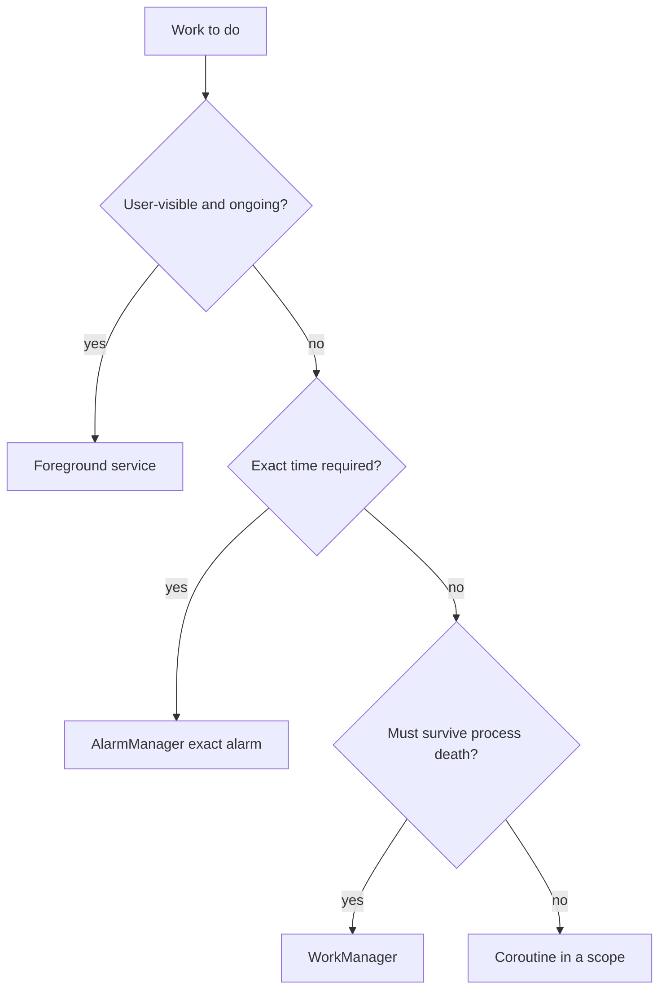

# ⚙️ Services & Background Work

*Which API runs your work when the user isn't looking. Covers service types, WorkManager, alarms and the OS limits (Doze, standby, background restrictions).*

## 🧩 Service types
<!-- related: tech-32, tech-30 -->

| Type | Started by | Lives until | Use |
|---|---|---|---|
| **Started** | `startService()` | `stopSelf()` / `stopService()` | Short self-contained task (restricted in background since O) |
| **Bound** | `bindService()` | Last client unbinds | Client-server API in/between apps (AIDL, Messenger) |
| **Foreground** | `startForegroundService()` + `startForeground()` | Stopped | User-aware ongoing work: music, navigation, calls, tracking |

- 📖 [Service types](https://www.geeksforgeeks.org/android/services-in-android-with-example/): Started, Bound, Foreground.

### 🔄 Lifecycle
- `onCreate()` → `onStartCommand()` (started) / `onBind()` (bound) → `onDestroy()`.
- `onStartCommand` returns `START_STICKY` / `START_NOT_STICKY` / `START_REDELIVER_INTENT` — the restart policy after a kill.
- A service runs on the **main thread** — offload the work yourself.
- [Foreground services](https://www.geeksforgeeks.org/android/foreground-service-in-android/) need a visible notification and (Android 14+) a declared `foregroundServiceType`.

## 🗓️ Choosing the API
<!-- related: tech-30, tech-82 -->



| API | Guaranteed | Constraints | Notes |
|---|---|---|---|
| Coroutine / executor | No | — | Dies with the process |
| **[WorkManager](https://www.geeksforgeeks.org/kotlin/android-jetpack-workmanager-with-example)** | Yes (persisted) | Network, charging, idle, storage | Default for deferrable work; JobScheduler underneath |
| [JobScheduler](https://www.geeksforgeeks.org/android/job-handling-in-android-13) | Yes | Yes | API 21+; wrapped by WorkManager |
| [AlarmManager](https://www.geeksforgeeks.org/android/how-to-build-a-simple-alarm-setter-app-in-android/) | Fires at a time | No | Exact alarms need a permission; use sparingly |
| High-priority push | Server-triggered | — | Wakes the app for urgent sync |

## 🛠️ WorkManager in practice
<!-- related: tech-31 -->

```kotlin
val sync = PeriodicWorkRequestBuilder<SyncWorker>(4, TimeUnit.HOURS)
  .setConstraints(
    Constraints.Builder()
      .setRequiredNetworkType(NetworkType.UNMETERED)
      .setRequiresCharging(true)
      .build()
  )
  .setBackoffCriteria(BackoffPolicy.EXPONENTIAL, 30, TimeUnit.SECONDS)
  .build()
WorkManager.getInstance(ctx)
  .enqueueUniquePeriodicWork("sync", ExistingPeriodicWorkPolicy.KEEP, sync)
```

- Minimum periodic interval is 15 min; timing is inexact by design.
- Chain: `beginWith(a).then(b).enqueue()`; outputs pass along as `Data`.
- `setExpedited()` for short urgent work; `setForeground()` for long work with a notification.
- Unique work names prevent duplicate enqueues across launches.
- 📖 [WorkManager](https://www.geeksforgeeks.org/android/overview-of-workmanager-in-android-architecture-components/) overview · [developer.android.com/topic/libraries/architecture/workmanager](https://developer.android.com/topic/libraries/architecture/workmanager).

## 🔋 OS restrictions

- **Doze** — an idle, unplugged, stationary device defers jobs, alarms and network into maintenance windows.
- **App Standby buckets** — rarely used apps get fewer job/alarm slots.
- **[Background execution](https://www.geeksforgeeks.org/android/what-to-use-for-background-processing-in-android/) limits (O+)** — no background `startService`; most implicit broadcasts can't be manifest-registered.
- **Foreground-service start limits (S+)** — can't start one from the background except for listed exemptions.
- **WakeLocks** — hold rarely, release in `finally`; a leaked wakelock drains the battery.

> 🔑 Design for "eventually": batch work, declare constraints, let the OS pick the moment.

> 📝 Practice: a music player service with controls; a download manager that respects Doze; a job that runs only when charging and on Wi-Fi.
