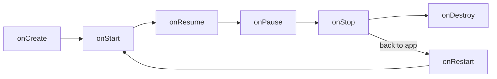

# 🔄 Lifecycle, Context & Components

*How Android creates, pauses and kills your UI. Covers Activity/Fragment lifecycle, config changes, process death, Context, Intents and the back stack.*

## 🔁 Activity & Fragment lifecycle
<!-- related: tech-6, tech-67, tech-130, tech-53 -->

- 📖 [Lifecycle](https://www.geeksforgeeks.org/android/activity-lifecycle-in-android-with-demo-app/): Activity/Fragment lifecycle, configuration changes.
- **Visible**: `onStart`–`onStop`. **Foreground/interactive**: `onResume`–`onPause`.
- Fragments add `onCreateView` / `onDestroyView` — the **view** lifecycle is shorter than the fragment's; observe with `viewLifecycleOwner`.
- [Lifecycle](https://www.geeksforgeeks.org/android/lifecycle-in-android-architecture-components/)-aware = components observe `Lifecycle` (via `LifecycleOwner`) instead of overriding callbacks.

> 🔑 Keep `onPause` fast — the next Activity's `onResume` waits for it.

## 🔃 Config changes & process death
<!-- related: tech-155, tech-95, tech-160, tech-12 -->

| Event | What dies | What survives |
|---|---|---|
| Rotation / locale / dark mode | Activity + views | `ViewModel`, saved state |
| Process death (low memory in background) | Everything in memory | `SavedStateHandle`, `onSaveInstanceState` bundle, disk |
| User swipes away / back | Activity + ViewModel | Only disk |

- [`ViewModel`](https://www.geeksforgeeks.org/android/viewmodel-in-android-architecture-components/) lives in a `ViewModelStore` retained across config changes — **not** process death.
- `SavedStateHandle` / `rememberSaveable` — small keys (ids, query text), not lists or bitmaps (~1 MB Binder limit).
- Test process death: *Don't keep activities* or `adb shell am kill <pkg>` while backgrounded.

## 🧭 Context
<!-- related: tech-99, tech-10 -->

| | Application Context | Activity Context |
|---|---|---|
| Lifetime | Process | Activity |
| Theme/resources | App theme | Activity theme |
| Can start Activity / show dialog | No dialogs; Activity needs `NEW_TASK` | Yes |
| Safe to hold long-term | Yes | No — leak risk |

- Singletons, repositories, DB: Application context. Inflating views, dialogs: Activity context.
- `getSystemService()` — obtain system managers (connectivity, notifications, alarms).
- 📖 [Context](https://www.geeksforgeeks.org/android/what-is-context-in/android/): Application vs. Activity, getting system services.

## 📨 Intents, filters, back stack
<!-- related: tech-69, tech-70, tech-71, tech-29 -->

- 📖 [Intents](https://www.geeksforgeeks.org/android/what-is-intent-in-android/): explicit vs. implicit, intent filters, pending intents.
- **Explicit** Intent — names the component (in-app navigation).
- **Implicit** Intent — declares an action/data; the system resolves via **intent filters** (action + category + data).
- **PendingIntent** — a token letting another app/system (notifications, alarms) fire your Intent with your identity; declare `FLAG_IMMUTABLE` unless mutation is needed.
- **[Task and Back Stack](https://www.geeksforgeeks.org/android/task-and-back-stack-in-android/)** — a task is a stack of Activities.

| [Launch Mode](https://www.geeksforgeeks.org/android/what-is-android-activity-launchmode/) | Behaviour |
|---|---|
| `standard` | New instance every time |
| `singleTop` | Reuse if already on top (`onNewIntent`) |
| `singleTask` | One instance in its task; clears above it |
| `singleInstance` | Alone in its own task |

## 📦 Other components
<!-- related: tech-33, tech-59, tech-86 -->

- **[BroadcastReceiver](https://www.geeksforgeeks.org/android/broadcast-receiver-in-android-with-example/)** — manifest (limited since O) or runtime-registered; `onReceive` has ~10 s and runs on main.
- **ContentProvider** — structured cross-app data with URI permissions; also used for init hooks.
- 📖 [developer.android.com/guide](https://developer.android.com/guide) — app fundamentals and components.
- **Parcelable** over Serializable for IPC/bundles — no reflection, faster.
- **[Notifications](https://www.geeksforgeeks.org/android/how-to-push-notification-in-android/)** — channels (O+) set importance per category; `POST_NOTIFICATIONS` runtime permission (13+; see [Permissions](https://www.geeksforgeeks.org/android/how-to-enable-notification-runtime-permission-in-android-13/)); heads-up for high importance; group with `setGroup` + summary.
