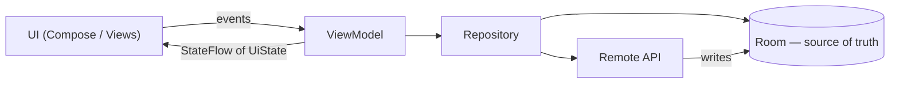

# 🏗️ App Architecture & Principles

*How to structure an Android app so it's testable and changeable. Covers MVC→MVVM→MVI, UDF, repositories, SOLID, patterns, DI and modularization.*

## 🪜 Pattern evolution
<!-- related: tech-75, tech-157, tech-46 -->

| Pattern | Who owns logic | Strength | Weakness |
|---|---|---|---|
| MVC | Activity (controller + view) | Simple | God Activities, untestable |
| MVP | Presenter via view interface | Testable | Boilerplate, manual lifecycle |
| **MVVM** | ViewModel exposing observable state | Lifecycle-safe, Jetpack-native | State can scatter across many streams |
| **MVI** | Reducer: `(state, intent) → state` | One immutable state, easy to replay | More ceremony |
| Clean Architecture | Layers: UI → domain → data | Clear dependency rule | Overkill for small apps |

- 📖 [Architecture patterns](https://www.geeksforgeeks.org/android/android-architecture-patterns/): MVC → MVP → MVVM → MVI → Clean Architecture; examples in [awesome-android-architecture](https://github.com/onmyway133/awesome-android-architecture).

## ➡️ Unidirectional data flow
<!-- related: tech-46, tech-74, tech-45 -->

- **State flows down, events flow up.**
- **Single source of truth** — the DB; network refreshes write into it and the UI observes it.
- `UiState` as a sealed/data class: Loading / Content / Error — impossible states unrepresentable.
- Repository hides where data comes from; ViewModel never knows about Retrofit or Room.
- 📖 [Architecture Components](https://www.geeksforgeeks.org/android/jetpack-architecture-components-in-android/) (ViewModel, LiveData, Room, WorkManager, Navigation, Paging) · [developer.android.com/topic/architecture](https://developer.android.com/topic/architecture).

> 🔑 The UI renders state; it never owns business decisions.

## 🧱 SOLID on Android
<!-- related: tech-186, tech-187, tech-188, tech-189, tech-190 -->

| Principle | Android shape |
|---|---|
| **S**ingle responsibility | Split a God ViewModel into use cases / smaller VMs |
| **O**pen/closed | Sealed item types + delegate adapters; add a type without editing a `when` everywhere |
| **L**iskov | A fake repository must honour the real one's contract (errors, ordering) |
| **I**nterface segregation | Small listeners instead of one fat callback |
| **D**ependency inversion | ViewModel depends on `UserRepository` interface; DI binds the impl |

- 📖 [SOLID Principles](https://www.geeksforgeeks.org/system-design/solid-principle-in-programming-understand-with-real-life-examples/) with real-life examples.
- [OOP Concepts](https://www.geeksforgeeks.org/dsa/introduction-of-object-oriented-programming/) pillars: encapsulation, abstraction, inheritance, polymorphism — prefer **composition over inheritance**.
- Programming paradigms: [OOPs](https://www.geeksforgeeks.org/system-design/object-oriented-programming-oop-concepts-for-designing-sytems/) · [Functional Programming](https://www.geeksforgeeks.org/blogs/functional-programming-paradigm/) · [Reactive Programming](https://www.geeksforgeeks.org/java/what-is-reactive-programming-in-java/) (Flow/RxJava).

## 🧩 Patterns you already use
<!-- related: tech-181, tech-182, tech-183, tech-184, tech-185, tech-176 -->

| Pattern | Android example |
|---|---|
| Builder | `NotificationCompat.Builder`, `Retrofit.Builder` |
| Factory | `ViewModelProvider.Factory` |
| Singleton | Room DB, OkHttp client — scope via DI, not `object` |
| Observer | `Flow`, `LiveData` |
| Decorator | `ContextWrapper`, OkHttp interceptors |
| Adapter | `RecyclerView.Adapter`, `ListAdapter` |

- 📖 [Design Patterns](https://www.geeksforgeeks.org/system-design/software-design-patterns/) · [Cheat Sheet](https://www.geeksforgeeks.org/system-design/design-patterns-cheat-sheet-when-to-use-which-design-pattern/) — when to use which.

## 💉 DI and modularization
<!-- related: tech-25, tech-65, tech-102, tech-151 -->

- **DI** ([Dependency Injection](https://www.geeksforgeeks.org/system-design/dependency-injectiondi-design-pattern/)) — dependencies passed in (constructor injection) → swappable fakes in tests. Hilt (compile-time, Dagger) vs Koin (runtime service locator).
- **Modules**: `:app` → `:feature:*` → `:core:*` (network, db, design system). Features never depend on each other.
- Benefits: parallel/incremental builds, ownership, enforced boundaries, dynamic delivery.
- Split when build time or team ownership hurts — not on day one.
- Single-Activity + [Navigation](https://www.geeksforgeeks.org/kotlin/overview-of-navigation-in-android-architecture-components/) for most apps; the host owns navigation, features expose routes.

> 📝 Practice: MVVM + Room repository for a user profile with a single-source-of-truth ViewModel.
