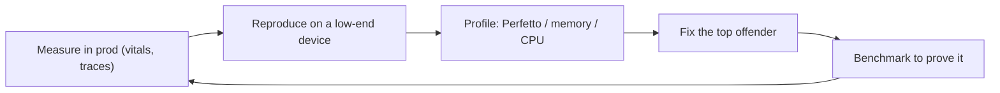

# ⚡ Performance: Battery, Memory, Jank, Startup

*Mobile performance is a budget across battery, memory, frames and launch time. Covers the main drains and the tools that find them.*

## 🔋 Battery
<!-- related: tech-30 -->

- **Radio is the big cost** — each wake keeps the cell radio in a high-power tail for seconds; **batch** requests, prefetch, prefer Wi-Fi/unmetered for bulk.
- **Location** — FusedLocationProvider, lowest accuracy that works, batched updates, geofences over polling.
- **WakeLocks** — rarely, with a timeout, released in `finally`.
- **Polling** — replace with push; if unavoidable, exponential backoff with jitter and stop when backgrounded.
- Respect Doze / App Standby; defer work with WorkManager constraints.

> 🔑 The cheapest request is the one you batch, cache or never make.

## 🧠 Memory
<!-- related: tech-10, tech-119, tech-98, tech-178, tech-147 -->

### 🕳️ Leak sources
- Static/singleton holding an Activity or View; non-static inner classes, Handlers, anonymous listeners.
- Unregistered listeners/receivers; coroutines in `GlobalScope`; Fragment binding kept after `onDestroyView`.

### 🖼️ Bitmaps
- Decode at display size (`inSampleSize`), `RGB_565` where alpha isn't needed, reuse via a bitmap pool.
- In-memory **LRU cache** sized to a fraction of the heap; trim in `onTrimMemory`.

```kotlin
val cache = object : LruCache<String, Bitmap>((Runtime.getRuntime().maxMemory() / 8).toInt()) {
  override fun sizeOf(key: String, value: Bitmap) = value.byteCount
}
```

- Avoid allocation in hot paths (`onDraw`, `onBindViewHolder`) → GC pauses → jank.
- Tools: **LeakCanary** (debug), Android Studio Memory Profiler, heap dumps.

## 🎞️ Jank and rendering
<!-- related: tech-35, tech-54, tech-34, tech-162, tech-8 -->

- **60 fps = 16.6 ms/frame** (90 Hz = 11 ms, 120 Hz = 8.3 ms) for input → measure → layout → draw → RenderThread → GPU.
- Causes: main-thread I/O, deep/nested layouts, overdraw, allocation churn, big bitmaps, too-wide recomposition.
- Frozen frame = > 700 ms.
- Fixes: flatten layouts (ConstraintLayout), `DiffUtil` / `ListAdapter` for lists, stable keys, precompute off-main.
- 📖 [UI System](https://www.geeksforgeeks.org/android/android-view-hierarchy/): Views, ViewGroups, custom views, measurement/layout/draw.
- Tools: Perfetto / system trace, JankStats, `FrameMetrics`, GPU overdraw debug, Layout Inspector.

## 🚀 Startup
<!-- related: tech-114, tech-146, tech-63, tech-115 -->

| Launch | State | Cost |
|---|---|---|
| Cold | No process | Highest — fork, `Application.onCreate`, first frame |
| Warm | Process alive, Activity recreated | Medium |
| Hot | Activity in memory | Lowest |

- Lazy-init SDKs (App Startup, DI lazies); nothing blocking in `Application.onCreate`.
- **Baseline Profiles** — AOT-compile hot startup paths; typical 20–30% win.
- Show real content fast: cached data first, then refresh.
- Measure with Macrobenchmark (`StartupTimingMetric`), not a stopwatch — see [Performance Optimization](https://www.geeksforgeeks.org/android/improve-android-app-performance-with-benchmarking/) with benchmarking.

## 🔍 Diagnose, don't guess



- 📖 [developer.android.com/topic/performance](https://developer.android.com/topic/performance) — official performance guides.
- Test on the **low end** — slow CPU, 2–3 GB RAM, slow storage; that's where the problems live.

> 📝 Practice: custom view that draws in < 16 ms; LRU bitmap cache with memory-pressure handling; battery-efficient polling with backoff.
