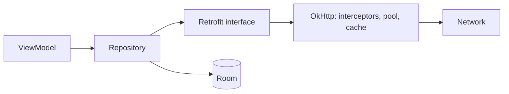
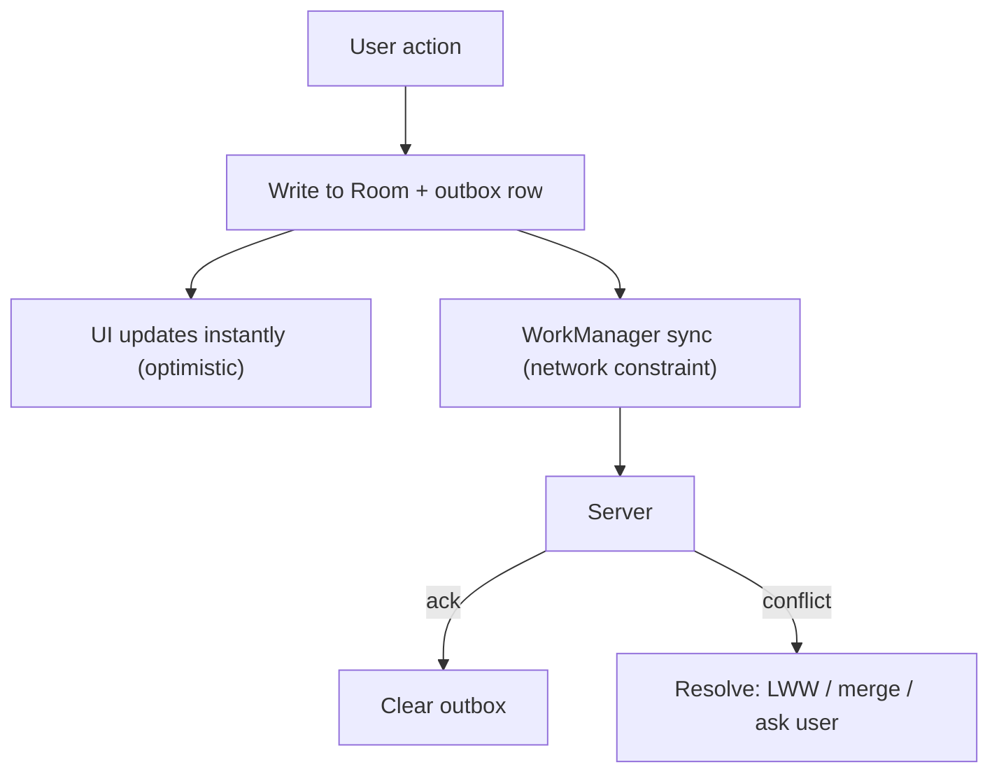

# 🌐 Networking, Caching & Offline-First

*The network is slow, flaky or absent. Covers the Retrofit/OkHttp stack, HTTP caching, retries, paging and offline sync on device.*

## 🔌 The client stack
<!-- related: tech-18, tech-96, tech-150, tech-165 -->

- **Retrofit** — interface → HTTP calls; `suspend` functions; converters (Moshi / kotlinx.serialization / Protobuf).
- **OkHttp** — connection pooling, HTTP/2 multiplexing, gzip, disk cache.
- **Interceptors** — application (once per call: auth header, logging) vs network (per network hop: sees redirects, cache headers).
- Tolerant parsing: default values, ignore unknown keys — the backend will evolve.

## 🗃️ HTTP caching
<!-- related: tech-148 -->

- `Cache-Control: max-age` — serve from disk with no request while fresh.
- **Conditional requests** — `ETag` → `If-None-Match`, `Last-Modified` → `If-Modified-Since`; server answers **304** with no body.
- OkHttp `Cache(dir, size)` does this automatically when headers are right.
- App-level cache: persist responses in Room for offline reads and a source of truth.

> 💡 A 304 still costs a round trip but saves the payload — great on metered networks.

## 🔁 Retries and flaky networks
<!-- related: tech-149, tech-20 -->

- Retry only **idempotent** calls, or send an **idempotency key** so the server de-duplicates POSTs.
- **Exponential backoff + jitter**, capped attempts; respect `Retry-After`.
- Don't retry 4xx (except 408/429).
- Token refresh: single-flight via a `Mutex` in an OkHttp `Authenticator` so ten 401s trigger one refresh.
- Check connectivity with `ConnectivityManager.NetworkCallback`, but treat it as a hint — the request is the truth.

## 📴 Offline-first
<!-- related: tech-101, tech-22 -->

- Reads: UI observes DB; network refresh writes into DB.
- Writes: **outbox queue** persisted locally, drained by WorkManager with backoff.
- Conflicts: last-write-wins (simple, loses data), field-level merge, version vectors, or app-specific rules.
- Show sync state: pending, failed, retry.
- **[Paging Library](https://www.geeksforgeeks.org/android/getting-started-with-paging-library-v3-in-android-using-kotlin-coroutines/) (Paging 3)** — `PagingSource` for one source; `RemoteMediator` pages network into Room and the UI pages from Room.

## 🖼️ Images
<!-- related: tech-97, tech-98 -->

- Coil/Glide: memory LRU → disk cache → network; decode at target size; cancel on view recycle; placeholder and error drawables.

> 📝 Practice: load and show an image from a URL without blocking the UI, with memory + disk caching; download a large file with progress; bidirectional sync between Room and an API.
