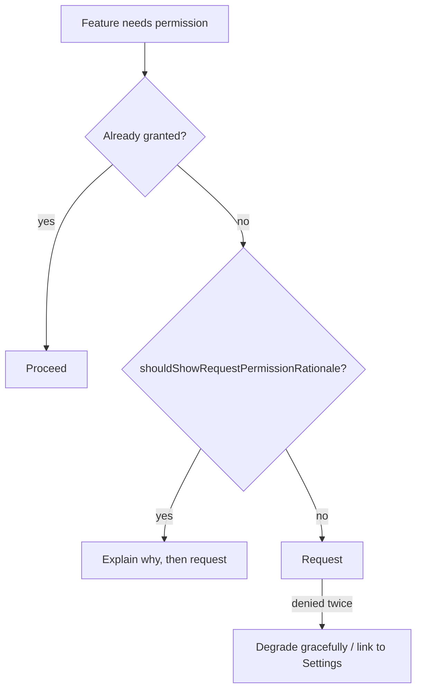

# 🔒 Permissions & Security

*Ask for the least, protect what you keep. Covers runtime permissions, scoped storage, encryption at rest and network security.*

## 🙋 Runtime permissions

| Level | Examples | Granted |
|---|---|---|
| Normal | Internet, vibrate | At install |
| Dangerous | Camera, location, contacts, mic | At runtime, per group |
| Special | Exact alarms, overlay, all-files | Settings screen |

- 📖 [Permissions & Security](https://www.geeksforgeeks.org/android-runtime-permissions/) · [Runtime permissions](https://www.geeksforgeeks.org/kotlin/android-run-time-permissions-using-jetpack-compose/) in Compose · [Permission groups](https://www.geeksforgeeks.org/android/what-are-the-different-protection-levels-in-android-permission/): dangerous vs. normal.
- Ask **in context**, at the moment of use; use `ActivityResultContracts.RequestPermission`.
- Location: foreground first, background separately; the user can grant approximate only.
- Declare data usage in the store's data-safety form.

## 🔐 Data at rest
<!-- related: tech-37, tech-62, tech-58 -->

- **Android Keystore** — keys generated and held in hardware (TEE/StrongBox); the app can use but not extract them.
- [Encryption](https://www.geeksforgeeks.org/android/encryption-and-decryption-application-in-android-using-caesar-cipher-algorithm/): encrypt tokens/PII with a Keystore-backed AES-GCM key; optionally bind to biometric auth.
- Never hardcode secrets in the APK — it's decompilable.
- Mark backups: exclude secrets via `dataExtractionRules`.

## 🛰️ Data in transit
<!-- related: tech-164, tech-180 -->

- [Network security](https://www.geeksforgeeks.org/computer-networks/what-is-mobile-application-security/): HTTPS only (`cleartextTrafficPermitted=false` in Network Security Config).
- **Certificate pinning** for high-value endpoints — pin public-key hashes with a backup pin and a rotation plan.
- WebView: disable JS/file access unless needed; never expose `addJavascriptInterface` to untrusted content.

## 🛡️ App hardening
<!-- related: tech-111, tech-118, tech-171 -->

- R8 shrinking/obfuscation raises reverse-engineering cost (not a security boundary).
- Integrity checks (Play Integrity) for tamper/root signals — enforce on the server.
- Exported components: `android:exported="false"` by default; permission-protect the rest.
- Log no PII or tokens; strip verbose logs in release.

> 🔑 The client is hostile territory: validate everything on the server.
