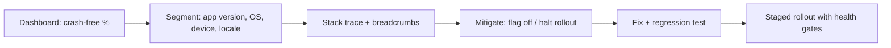

# 🚀 Production Readiness, Accessibility & i18n

*What separates a demo from a shipped app. Covers error handling, logging, testing, crash triage, feature flags, accessibility and localization.*

## 🧯 Errors and logging
<!-- related: tech-83 -->

- [Error handling](https://www.geeksforgeeks.org/android/exceptions-in-android-with-example/): model failures explicitly: `Result`/sealed `UiState.Error` with a user-facing message and a retry action.
- Catch at boundaries (repository, worker), not everywhere; never swallow silently.
- [Logging](https://www.geeksforgeeks.org/android/android-enable-logging-in-okhttp/): `Log.v/d/i/w/e` — verbose/debug stripped in release; no PII.
- Crash reporting ([Crash handling](https://www.geeksforgeeks.org/firebase/introduction-to-firebase-performance-monitoring/), e.g. Crashlytics): breadcrumbs, custom keys, **non-fatal** logging for caught-but-unexpected errors.

## 🧪 Testing
<!-- related: tech-144, tech-23, tech-61, tech-47, tech-80 -->

| Layer | Tool | Speed | Fidelity |
|---|---|---|---|
| Unit (ViewModel, use case) | JUnit + fakes, Turbine, `runTest` | Fast | Low |
| Integration (Room, repo) | Robolectric / in-memory DB | Medium | Medium |
| UI | Compose test rule, Espresso | Slow | High |
| Performance | Macrobenchmark | Slow | Real device |

- 📖 [Testing](https://www.geeksforgeeks.org/android/testing-an-android-application-with-example/): unit tests for business logic, instrumented tests for Android.
- Prefer **fakes** over mocks for your own interfaces; inject `TestDispatcher`s.

## 🚨 "The app crashes for X% of users"
<!-- related: tech-83, tech-9 -->

- Segmenting usually finds the cause: one OEM, one OS version, low RAM, one new feature.
- Mitigate **first** (kill switch, pause rollout), then fix.
- 📖 [developer.android.com/topic/quality](https://developer.android.com/topic/quality) — app quality guidelines.

## 🚩 Flags and rollout

- [Feature flags](https://www.geeksforgeeks.org/firebase/introduction-to-setting-up-remote-config-in-your-firebase-project/): remote config for gradual rollout, A/B tests and **kill switches**.
- Staged store rollout in [play.google.com/console](https://play.google.com/console) (1% → 10% → 50% → 100%) gated on crash/ANR rates.
- [Monitoring](https://www.geeksforgeeks.org/android/android-app-performance-metrics/): analytics funnels, performance traces, ANR rate, vitals — [firebase.google.com](https://firebase.google.com/) (Crashlytics, Analytics, Remote Config, Messaging).
- 📖 [Git](https://www.atlassian.com/git/tutorials/what-is-git) · [Advanced Git](https://www.atlassian.com/git/tutorials/advanced-overview) · [SSH Keys](https://www.atlassian.com/git/tutorials/git-ssh) — release branches and hotfixes behind a rollout.

## ♿ Accessibility & i18n
<!-- related: tech-104, tech-64 -->

- `contentDescription` on meaningful images (null for decorative); semantics in Compose.
- Touch targets ≥ 48 dp; sufficient contrast; don't rely on colour alone.
- Support font scaling (`sp`, no fixed heights); test with TalkBack.
- Strings in `strings.xml` ([Resources](https://www.geeksforgeeks.org/android/android-res-values-folder/): dimensions, strings, styles, themes); **plurals** via `getQuantityString`; placeholders not concatenation.
- RTL: `start`/`end` not `left`/`right`, `supportsRtl=true`, mirror directional icons.

- 📖 [Accessibility & Internationalization](https://www.geeksforgeeks.org/android/what-is-accessibility-service-in-android/) — accessibility services and TalkBack.

> 🔑 Accessibility and localization are built in from the first screen, not bolted on.
