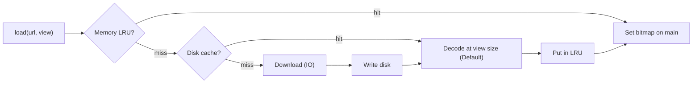

# ⌨️ Platform-Side Coding Round

*Android coding rounds skew toward the platform — threading, scheduling, caching — not pure algorithms. Covers how to approach them and model answers for common tasks.*

## 🧭 How to approach it
<!-- related: tech-153, tech-113 -->

- Expect to write **part** of a solution and talk through the rest; fundamentals beat API recall.
- Expect **compare-and-justify**: two approaches, their tradeoffs, why you pick one.
- Flow: clarify → state constraints → sketch the API/interfaces → code the core → name edge cases → discuss scale-down.
- Name the mobile constraints even in code: **device diversity** (low-end CPU/RAM), **connectivity** (offline, flaky), **compute** (bounded work).

- 📖 [Roadmap](https://roadmap.sh/android) — the full Android topic map.

> 🔑 Say which thread every line runs on and who cancels it.

## 🖼️ Image loader with caching
<!-- related: tech-97, tech-98 -->



```kotlin
class ImageLoader(private val scope: CoroutineScope, private val cache: LruCache<String, Bitmap>) {
  private val inFlight = mutableMapOf<String, Deferred<Bitmap>>() // main-confined
  fun load(url: String, view: ImageView) {
    cache[url]?.let { view.setImageBitmap(it); return }
    (view.tag as? Job)?.cancel()            // recycled view: cancel old request
    view.tag = scope.launch(Dispatchers.Main) {
      val d = inFlight.getOrPut(url) { scope.async(Dispatchers.IO) { fetchAndDecode(url) } }
      val bmp = try { d.await() } finally { inFlight.remove(url) }
      cache.put(url, bmp); view.setImageBitmap(bmp)
    }
  }
}
```

- Talk through: de-duplicating in-flight requests, cancel on recycle, downsampling, `onTrimMemory`.

## 🏊 Bounded worker pool on low memory
<!-- related: tech-113, tech-15 -->

- Cap concurrency to what memory allows, not CPU count alone — decoding 8 large bitmaps at once OOMs a 2 GB device.

```kotlin
val permits = Semaphore(2)
suspend fun processAll(items: List<Uri>) = coroutineScope {
  items.map { uri ->
    async(Dispatchers.Default) { permits.withPermit { process(uri) } }
  }.awaitAll()
}
```

- Bounded channel/queue for backpressure; drop or coalesce when the queue is full; cancel on screen exit.

## 📥 Download with progress
<!-- related: tech-30, tech-31 -->

- WorkManager (survives process death) + `setForeground` for long downloads; `setProgress` observed by the UI.
- Resume with `Range` headers; write to a temp file then rename; checksum at the end.
- Constraints: unmetered network, storage not low.

## 📝 Practice list

| Area | Tasks |
|---|---|
| Threading | Image loader; large download with progress; parallel image worker pool; network → parse → save → notify chain |
| Background | Foreground location service; 4-hourly sync; charging + Wi-Fi job; music playback service |
| Architecture | MVVM + Room profile; Paging 3 with network + cache; two-way sync |
| Performance | DiffUtil list updates; LRU bitmap cache; < 16 ms custom view; backoff polling |
| Storage | Camera → scoped storage; SAF picker; Doze-aware downloader |
| Notifications | Chat channel with reply action; call heads-up; grouped messages |

- 📖 More questions: https://github.com/amitshekhariitbhu/android-interview-questions
