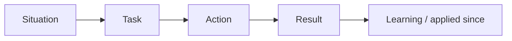

# ⭐ STAR Method & Answer Structure

*A behavioural answer is a short story with a shape: Situation → Task → Action → Result, closed with a learning. Structure keeps you brief on context and long on what you did.*

## 🧱 The four beats
<!-- related: behav-1, behav-2 -->

### 🔤 STAR

| Beat | Answers | Share of time |
|---|---|---|
| **S**ituation | Where, when, what was at stake | ~10% |
| **T**ask | What *you* owned; the goal or constraint | ~10% |
| **A**ction | What *you* did, step by step, and why | ~60% |
| **R**esult | Measurable outcome + what you learned | ~20% |



> 🔑 Situation and Task are the setup, not the story. Get to Action within ~30 seconds.

### ➕ Variants
- **STAR-L / CARL** — adds an explicit **Learning** beat; most interviewers expect it anyway.
- **SOAR** — Situation, Obstacle, Action, Result; useful when the obstacle *is* the story.
- **PAR** — Problem, Action, Result; a compressed form for quick follow-ups.

## ⏱️ Length & timing
<!-- related: behav-16 -->

### 🕐 Target
- **90–150 seconds** per story, spoken.
- Under 60 s → too thin to probe; over 3 min → the interviewer loses the thread and runs out of time for other signals.
- A typical 45-minute round covers **3–5 stories** plus follow-ups.

### 🎚️ Calibrating depth
- Lead with a one-line headline: what it was about and how it ended.
- Offer depth rather than dumping it: stop after Result and let follow-ups pull detail.

> 💡 Still in Situation after 45 seconds? Jump: "The key part was what I did next…"

## 🗣️ Delivery techniques
<!-- related: behav-17, behav-19 -->

### ✍️ Rules of thumb
- **"I", not "we"** — the team's work is context; your decisions are the answer.
- **Specific + quantified** — "cut p95 latency from 800 ms to 300 ms" beats "improved performance".
- **Name roles** — "my PM and the backend lead" makes the story concrete and credible.
- **Admit the wobble** — "I first assumed X; the data showed Y" shows judgement evolving.
- **Close the loop** — "Since then I've applied this by…".
- **Explain the why** behind each action, not just the what.

### 📋 Fill-in template

```text
Headline: A time I <did X> which led to <outcome>.
S: At <context>, <problem> was putting <stake> at risk.
T: I owned <scope>; the goal was <measurable target> by <constraint>.
A: First I <step + reason>. Then <step + reason>.
   The hard part was <obstacle>; I <handled it>.
R: <metric moved>, <who benefited>.
   I learned <insight>; since then I <applied it>.
```

> 📝 Practice: time any story aloud and cut Situation until Action starts before 30 seconds.

## 🧩 One story, many signals

### 🔁 Reuse
- A strong story usually shows 2–3 competencies (e.g. ambiguity + stakeholder management + impact).
- Re-angle the same story by changing which Action beats you emphasise.
- Don't force-fit: a success story with a small hiccup won't land as a failure answer.

> 🔑 Answer the question asked, then pick the story — never the other way round.
