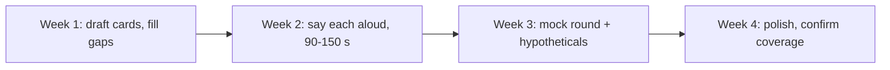

# 📚 Building a Story Bank

*Prepare 8–12 reusable stories, tag each with the signals it proves, and cover every competency at least twice. Know the flow, not a script.*

## 🏗️ Choosing stories
<!-- related: behav-1, behav-16 -->

### 🔎 Where to mine
- Big projects: launches, migrations, redesigns.
- Incidents and bugs you owned end-to-end.
- Disagreements: with a peer, a lead, a PM, another team.
- Failures: missed deadline, wrong technical call, bad estimate.
- People moments: mentoring, giving/receiving hard feedback, onboarding.
- Unasked-for improvements: process, tooling, quality.

### ✅ A good story has
- A real **stake** (users, money, time, trust).
- A **decision point** where you chose among options.
- **Your** actions, distinct from the team's.
- A **measurable** result — or an honest "it didn't work, and here's why".
- A **learning** you can show you applied later.

> 💡 Recent (last 2–3 years) and level-appropriate beats dramatic but old.

## 🗂️ Coverage matrix
<!-- related: behav-2, behav-9, behav-26 -->

### 📊 Tag stories against signals

| Story | Ambiguity | Conflict | Failure | Feedback | Leadership | Impact | User-first |
|---|---|---|---|---|---|---|---|
| Story A | ✅ | | | | ✅ | ✅ | |
| Story B | | ✅ | | ✅ | | | |
| Story C | | | ✅ | | | | ✅ |

- Aim for **every column ≥ 2 stories** so you never repeat one across a loop.
- Empty columns are the gaps to draft first — commonly **failure**, **ethics**, **feedback from above**, **self-development**, **working styles**.

> 🔑 Never invent a story. If you have a gap, find a smaller real one.

## ✍️ Writing each story

### 📋 Card template

```text
Title: <5-word handle>
Signals: <2-3 tags>
S (1 line):
T (1 line):
A (3-5 bullets, each with a why):
R (metric + who benefited):
Learning / applied since:
Likely follow-ups: <do differently? who disagreed? how measured?>
```

- Write bullets, not prose — you'll speak it, not recite it.
- Fill every number beforehand; a blank in your notes becomes "um" out loud.

## 🗓️ Rehearsal plan



- Record yourself; cut filler and over-long context.
- Have a peer fire random signal prompts and follow-ups.
- Over-preparation smell: identical wording every time. Adapt to the question.

> 📝 Practice: have someone read a random row from the signal table; pick a story and start within 5 seconds.
