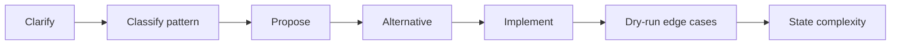
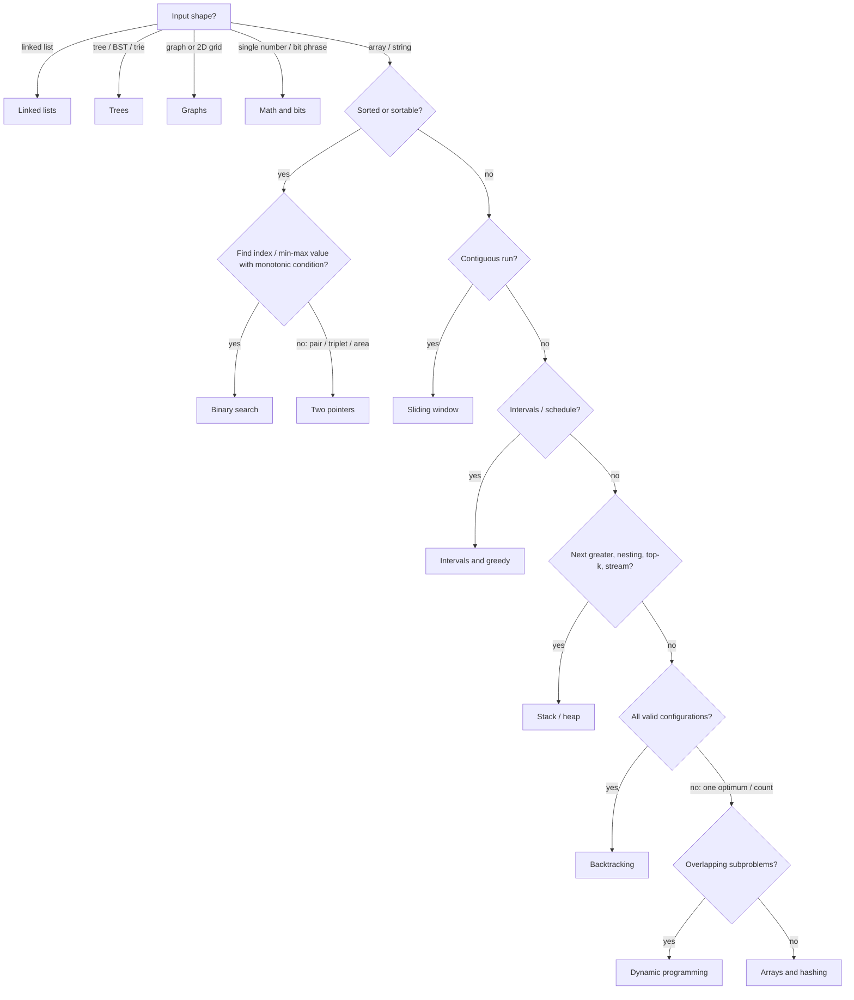

# 🧭 Problem-Solving Method

*A repeatable loop for any coding question: clarify, classify the pattern, propose, refine, implement, test, state complexity.*

## 🪜 The five-step loop

### 🔁 Steps
1. **Clarify** — input size, ranges, duplicates, negatives, empty input, sorted?, return shape.
2. **Define the approach** — name the pattern out loud ("this is a sliding window").
3. **Propose a solution** — say up front it's a first cut you'll refine.
4. **Propose an alternative** — a second approach with a different time/space trade-off shows depth.
5. **Implement** — real, compilable code; then test edge cases unprompted and state time + space.

> 🔑 Budget ~20–25 min per problem; if you can't name the pattern in 3 minutes, walk the decision tree.

### 🧪 Edge cases to always try
- Empty / single element; all equal; already sorted / reverse sorted.
- Negatives, zero, `Int.MAX_VALUE` overflow.
- Duplicates; target absent; answer at index 0 or n-1.

## 🌳 Pattern decision tree

> 💡 Say each branch decision out loud — it doubles as "clarify" and "define approach".

## ⚖️ Tie-breakers

| Looks like both | Pick | Because |
|---|---|---|
| Sliding window vs two pointers | Window | answer is a contiguous run |
| | Two pointers | answer is a pair / fixed-size group |
| Backtracking vs DP | Backtracking | wants every valid arrangement |
| | DP | wants best value or count |
| Graph vs tree | Graph | cycles or multiple parents possible |
| | Tree | strict parent→child, no cycles |
| Greedy vs DP (intervals) | Greedy | sort + one pass provably optimal |
| | DP | must weigh include vs exclude |

## 📏 Complexity cheat sheet

| n up to | Target complexity | Typical technique |
|---|---|---|
| 10–12 | O(n!) / O(2ⁿ·n) | backtracking, permutations |
| 20–25 | O(2ⁿ) | subsets, bitmask |
| 500 | O(n³) | interval DP, Floyd–Warshall |
| 5 000 | O(n²) | 2D DP, nested loops |
| 10⁶ | O(n log n) | sort, heap, binary search |
| 10⁸ | O(n) / O(log n) | hashing, two pointers, math |

> 🔑 Backtracking complexity ≈ branching factor ^ depth × work per node.

## 🧠 Concepts beyond patterns

- **NP-complete in disguise** — travelling salesman (visit all, minimize cost), knapsack (pick items under a budget), subset sum, graph colouring. Recognize them: exact answers need exponential search or pseudo-polynomial DP; say so and offer DP for small bounds or a greedy approximation.
- **Combinatorics** — C(n, k) = n! / (k!(n−k)!); Pascal: C(n,k) = C(n−1,k−1) + C(n−1,k); permutations P(n,k) = n!/(n−k)!; stars and bars C(n+k−1, k−1).
- **Probability** — independent events multiply; expected value is linear; count favourable / total for uniform spaces.
- **Practice discipline** — identify the pattern before coding; practise without an IDE (plain editor, no autocomplete); do timed sets for raw speed.
- **Core structures refresher** — [Data Structures](https://www.geeksforgeeks.org/dsa/data-structure-meaning/): string, array, linked list, hash map / set, tree.

> 📝 Practice: count paths in an m×n grid moving right/down — solve with C(m+n−2, m−1) and with DP; compare.
