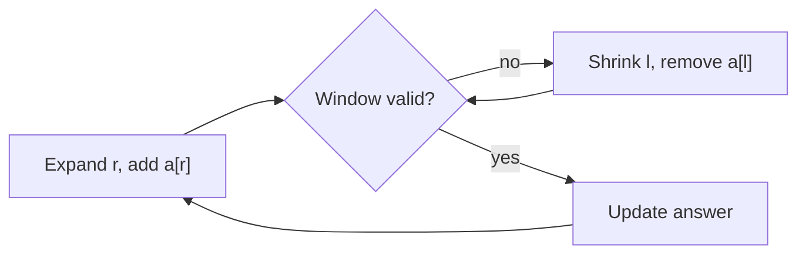

# 🪟 Sliding Window

*Longest / shortest / best contiguous subarray or substring: expand right, shrink left when the window breaks, record the answer while it's valid.*

## 🔎 Recognize it
<!-- related: ds-3, ds-55 -->

- Keyword **contiguous**: "longest/shortest/max/min substring or subarray such that…".
- Elements may be non-adjacent → not a window (think DP or recursion).
- Brute force enumerates O(n²) subarrays; the window reuses work → O(n).

> 🔑 Each index enters and leaves the window at most once — that is the O(n) argument.

## 🧩 Templates
<!-- related: ds-55, ds-32 -->

### 📏 Fixed size k
- Add `a[r]`, remove `a[r - k]` once `r >= k`; evaluate when the window is full.

### 🔀 Variable size



```kotlin
fun lengthOfLongestSubstring(s: String): Int {
    val last = HashMap<Char, Int>()
    var l = 0; var best = 0
    for (r in s.indices) {
        last[s[r]]?.let { if (it >= l) l = it + 1 }
        last[s[r]] = r
        best = maxOf(best, r - l + 1)
    }
    return best
}
```

| Goal | Shrink while | Record answer |
|---|---|---|
| Longest valid | window is invalid | after shrinking |
| Shortest valid | window is valid | inside the shrink loop, before removing |

> 💡 "At most k distinct" → map of counts, shrink while `map.size > k`. "Exactly k" = atMost(k) − atMost(k − 1).

## 📈 Monotonic deque and variants
<!-- related: ds-63 -->

- **Window max/min** — deque of indices with decreasing values; pop back while smaller, pop front when out of range → O(n).
- **Minimum window substring** — need-counts map + a `formed` counter; shrink while all requirements hold.
- **Buy/sell once** — track min so far; profit = price − min.
- Negative numbers break "shrink when sum ≥ target" — switch to prefix sums + map or deque.

> 📝 Practice: [Longest Substring Without Repeating Characters](https://leetcode.com/problems/longest-substring-without-repeating-characters) · [Minimum Size Subarray Sum](https://leetcode.com/problems/minimum-size-subarray-sum) · [Fruit Into Baskets](https://leetcode.com/problems/fruit-into-baskets) · [Maximum Average Subarray I](https://leetcode.com/problems/maximum-average-subarray-i) · [Minimum Window Substring](https://leetcode.com/problems/minimum-window-substring) · Sliding Window Maximum · [Best Time to Buy and Sell Stock](https://leetcode.com/problems/best-time-to-buy-and-sell-stock).
