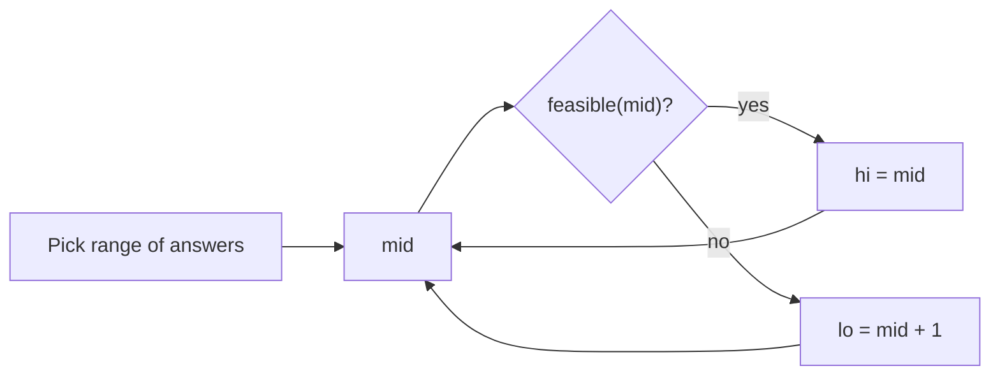

# 🔍 Binary Search

*Halve the search space each step — on a sorted index range, or on the answer itself when feasibility is monotonic.*

## 🔎 Recognize it
<!-- related: ds-16 -->

- Data is sorted or rotated-sorted.
- "Minimum/maximum value such that…" where if k works, every larger (or smaller) k works too.
- O(n) is obvious, but O(log n) is expected.

> 🔑 Define the invariant (`lo`/`hi` meaning) **before** writing the loop.

## 🧩 Templates
<!-- related: ds-16, ds-66 -->

### 🎯 Lower bound (first index where predicate is true)

```kotlin
fun firstTrue(lo0: Int, hi0: Int, ok: (Int) -> Boolean): Int {
    var lo = lo0; var hi = hi0          // answer in [lo, hi]; hi = "none" sentinel
    while (lo < hi) {
        val mid = lo + (hi - lo) / 2    // no overflow
        if (ok(mid)) hi = mid else lo = mid + 1
    }
    return lo
}
```

| Style | Loop | Updates | Use |
|---|---|---|---|
| Exact match | `lo <= hi` | `lo = mid + 1` / `hi = mid - 1` | find a value |
| Boundary | `lo < hi` | `hi = mid` / `lo = mid + 1` | first true, insert position |
| Upper-mid | `lo < hi`, `mid = lo + (hi-lo+1)/2` | `lo = mid` / `hi = mid - 1` | last true |

> 💡 Infinite loop? You used `lo = mid` with a lower mid. Round mid toward the side that moves.

## 🎯 Binary search on the answer
<!-- related: ds-66 -->

- Search the value space `[minPossible, maxPossible]`, not indices.
- Write `feasible(x)`: O(n) check. Total O(n log range).
- Examples: minimum eating speed, minimum ship capacity in D days, integer square root.



## 🔄 Twists
<!-- related: ds-56 -->

- **Rotated sorted** — one half is always sorted; check if target lies in it, else go to the other half.
- **Single element in sorted pairs** — compare `a[mid]` with its pair partner (`mid xor 1`); parity tells which side is broken.
- **Median of two sorted arrays** — binary search the partition of the smaller array so left halves ≤ right halves → O(log min(m, n)).
- Pitfalls: `(lo + hi) / 2` overflow, `<` vs `<=`, empty array, duplicates in rotated arrays (worst case O(n)).

> 📝 Practice: [Sqrt(x)](https://leetcode.com/problems/sqrtx) · [Search in Rotated Sorted Array](https://leetcode.com/problems/search-in-rotated-sorted-array) · [Koko Eating Bananas](https://leetcode.com/problems/koko-eating-bananas) · [Single Element in a Sorted Array](https://leetcode.com/problems/single-element-in-a-sorted-array) · [Median of Two Sorted Arrays](https://leetcode.com/problems/median-of-two-sorted-arrays).
