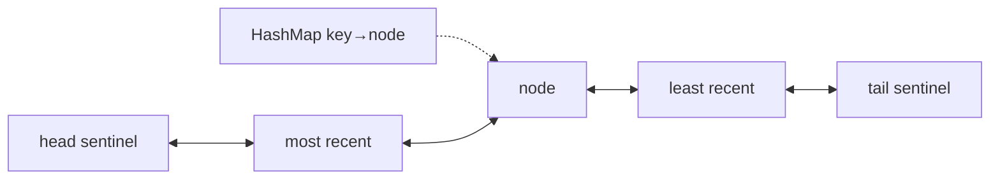

# 🔗 Linked Lists

*Pointer surgery, not arithmetic: dummy heads remove edge cases, fast/slow pointers find middles and cycles, three pointers reverse in place.*

## 🔎 Recognize it
<!-- related: ds-4, ds-5 -->

- Input is a `ListNode` (singly or doubly linked), not an array.
- The ask is rewiring: reverse, merge, detect cycle, remove n-th from end, reorder.

| Operation | Singly linked | Array |
|---|---|---|
| Access i-th | O(n) | O(1) |
| Insert/delete at known node | O(1) | O(n) |
| Insert at head | O(1) | O(n) |

> 🔑 Draw the list and every arrow change before coding.

## 🧰 Core techniques
<!-- related: ds-5, ds-4, ds-58 -->

### 🪆 Dummy head
- `val dummy = ListNode(0).apply { next = head }` — removing the head becomes a normal case; return `dummy.next`.

### ↩️ Reverse in place

```kotlin
fun reverse(head: ListNode?): ListNode? {
    var prev: ListNode? = null; var cur = head
    while (cur != null) {
        val nxt = cur.next
        cur.next = prev
        prev = cur; cur = nxt
    }
    return prev
}
```

### 🐢🐇 Fast / slow
- **Middle** — fast moves 2, slow moves 1; slow ends at the middle.
- **Cycle** (Floyd) — they meet inside the cycle; reset one to head, step both by 1 → cycle start.
- **N-th from end** — advance fast n steps, then move both.

> 💡 Palindrome check in O(1) space: find middle, reverse second half, compare, restore.

## 🧩 Composite problems
<!-- related: ds-43, ds-23, ds-6 -->

- **Merge two sorted** — dummy + tail pointer; attach the smaller node.
- **Add two numbers** — walk both with a carry; loop while either list or carry remains.
- **Merge k sorted** — min-heap of heads → O(N log k).
- **LRU cache** — hash map `key → node` + doubly linked list (head = most recent); O(1) get/put.



> 📝 Practice: [Reverse Linked List](https://leetcode.com/problems/reverse-linked-list) · [Merge Two Sorted Lists](https://leetcode.com/problems/merge-two-sorted-lists) · [Linked List Cycle](https://leetcode.com/problems/linked-list-cycle) · [Add Two Numbers](https://leetcode.com/problems/add-two-numbers) · [LRU Cache](https://leetcode.com/problems/lru-cache).
