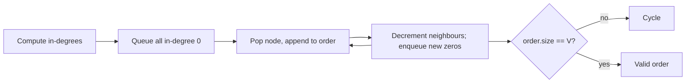

# 🕸️ Graph Algorithms

*BFS for shortest unweighted paths and levels, DFS for connectivity, topological sort for dependencies, Dijkstra for weighted shortest paths — grids are graphs in disguise.*

## 🔎 Recognize it
<!-- related: ds-7, ds-19 -->

- Explicit nodes + edges, or a 2D grid (cells = nodes, 4-directional neighbours).
- Ask: reachability, shortest path, connected components, "can all tasks finish given dependencies".
- Weighted edges + shortest path → Dijkstra, not plain BFS.

> 🔑 Always mark visited — at **enqueue** time for BFS, or you'll count nodes twice.

## 🗺️ Representations

| Representation | Space | Edge check | Iterate neighbours | Best for |
|---|---|---|---|---|
| Adjacency list | O(V + E) | O(deg) | O(deg) | sparse graphs (most problems) |
| Adjacency matrix | O(V²) | O(1) | O(V) | dense graphs, Floyd–Warshall |
| Objects / pointers | O(V + E) | O(deg) | O(deg) | clone graph, tree-like input |
| Implicit grid | none extra | O(1) | 4 or 8 | islands, flood fill |

## 🚶 BFS and DFS
<!-- related: ds-7, ds-19, ds-26 -->

| | BFS | DFS |
|---|---|---|
| Structure | queue | stack / recursion |
| Finds | shortest path in unweighted graphs | any path, components, cycles |
| Memory | widest level | deepest path |

```kotlin
fun numIslands(g: Array<CharArray>): Int {
    var count = 0
    fun sink(r: Int, c: Int) {
        if (r !in g.indices || c !in g[0].indices || g[r][c] != '1') return
        g[r][c] = '0'
        sink(r + 1, c); sink(r - 1, c); sink(r, c + 1); sink(r, c - 1)
    }
    for (r in g.indices) for (c in g[0].indices) if (g[r][c] == '1') { count++; sink(r, c) }
    return count
}
```

- **Multi-source BFS** — enqueue all sources at time 0 (rotting oranges, distance to nearest).
- **Reverse flow** — search from the targets inward (Pacific–Atlantic from both oceans).
- **Union-Find** — near-O(1) merges with path compression + union by rank; dynamic connectivity.

## 📋 Topological sort
<!-- related: ds-20 -->

- Only on a DAG; a leftover node means a cycle.
- **Kahn** — queue nodes with in-degree 0; pop, append, decrement neighbours.
- **DFS** — post-order, then reverse; three colours detect back edges.



## 🛣️ Weighted shortest paths
<!-- related: ds-21 -->

| Algorithm | Handles | Time |
|---|---|---|
| BFS | unweighted | O(V + E) |
| 0-1 BFS (deque) | weights 0/1 | O(V + E) |
| Dijkstra | non-negative weights | O((V + E) log V) |
| Bellman–Ford | negative weights, detects negative cycles | O(V·E) |
| A* | Dijkstra + admissible heuristic toward one target | ≤ Dijkstra in practice |

```kotlin
fun dijkstra(n: Int, adj: List<List<Pair<Int, Int>>>, src: Int): IntArray {
    val dist = IntArray(n) { Int.MAX_VALUE }.also { it[src] = 0 }
    val pq = java.util.PriorityQueue<Pair<Int, Int>>(compareBy { it.second })
    pq.add(src to 0)
    while (pq.isNotEmpty()) {
        val (u, d) = pq.poll()
        if (d > dist[u]) continue                     // stale entry
        for ((v, w) in adj[u]) if (d + w < dist[v]) { dist[v] = d + w; pq.add(v to dist[v]) }
    }
    return dist
}
```

> 💡 A* orders the heap by `g + h`; with h = 0 it is Dijkstra. Heuristic must never overestimate (e.g. Manhattan distance on a grid).

> 💡 "Maximize the minimum along a path" (safest path) → Dijkstra with a max-heap on the bottleneck, or binary search on the answer + BFS.

> 📝 Practice: [Number of Islands](https://leetcode.com/problems/number-of-islands) · [Rotting Oranges](https://leetcode.com/problems/rotting-oranges) · [Pacific Atlantic Water Flow](https://leetcode.com/problems/pacific-atlantic-water-flow) · Course Schedule · [Network Delay Time](https://leetcode.com/problems/network-delay-time) · [Find the Safest Path in a Grid](https://leetcode.com/problems/find-the-safest-path-in-a-grid).
