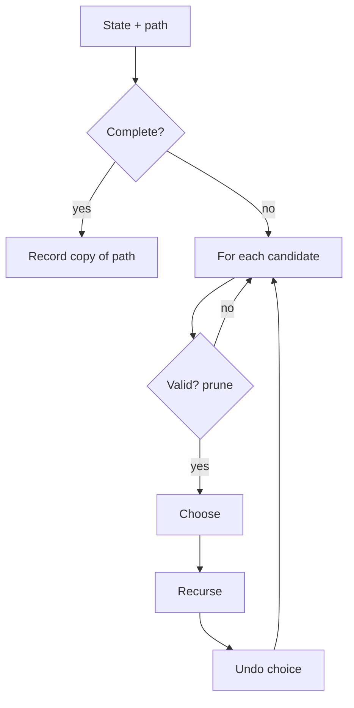

# 🔁 Recursion & Backtracking

*DFS over a decision tree: choose, recurse, un-choose. Prune before recursing, and keep constraint checks O(1).*

## 🔎 Recognize it
<!-- related: ds-42 -->

- "Generate all…", "every combination / permutation / subset / arrangement".
- Constraint puzzles: N-Queens, Sudoku, word search.
- Answer is a **set of valid configurations**. Only the count or best value? Check DP first.

> 🔑 Complexity ≈ branching factor ^ depth × work per leaf — state it explicitly.

## 🧩 The template
<!-- related: ds-42 -->



```kotlin
fun subsetsWithDup(nums: IntArray): List<List<Int>> {
    nums.sort()
    val out = mutableListOf<List<Int>>(); val path = ArrayList<Int>()
    fun go(start: Int) {
        out += path.toList()
        for (i in start until nums.size) {
            if (i > start && nums[i] == nums[i - 1]) continue   // skip duplicate branch
            path.add(nums[i]); go(i + 1); path.removeAt(path.size - 1)
        }
    }
    go(0)
    return out
}
```

## 🌲 Shapes of the search

| Problem | Branch on | Count | Dedupe trick |
|---|---|---|---|
| Subsets | include / exclude, or `start` index | 2ⁿ | sort + skip equal siblings |
| Combinations (k of n) | `start` index | C(n, k) | same |
| Permutations | unused element | n! | `used[]` + skip equal unused sibling |
| Phone letter combos | letters of the next digit | 4ⁿ | none |
| Generate parentheses | `(` if open < n, `)` if close < open | Catalan(n) | constraints prevent dupes |

> 💡 Record `path.toList()` — adding the mutable `path` itself stores the same list n times.

## ✂️ Pruning and constraint checks

- Check validity **before** recursing, not after.
- **N-Queens** — one queen per row; sets (or bitmasks) for columns, `r - c` and `r + c` diagonals → O(1) checks.
- **Sudoku** — row/column/box bitmasks; fill the cell with fewest candidates first.
- **Word search** — mark the cell visited in place, restore on return.
- Sort candidates so you can `break` once the remaining sum exceeds the target (combination sum).

> 📝 Practice: [Subsets II](https://leetcode.com/problems/subsets-ii) · [Permutations](https://leetcode.com/problems/permutations) · [Letter Combinations of a Phone Number](https://leetcode.com/problems/letter-combinations-of-a-phone-number) · [Generate Parentheses](https://leetcode.com/problems/generate-parentheses) · [N-Queens](https://leetcode.com/problems/n-queens) · Word Search.
