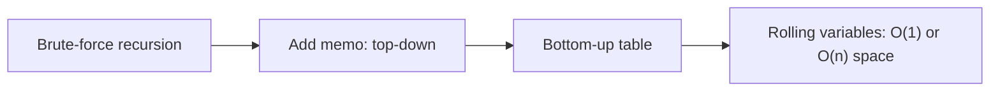

# 🧩 Dynamic Programming

*Recursion with overlapping subproblems, cached: define the state, write the transition, fill bottom-up, then shrink the table.*

## 🔎 Recognize it
<!-- related: ds-12 -->

- "Minimum / maximum / number of ways to…".
- Brute-force recursion recomputes the same arguments → overlapping subproblems.
- Optimal substructure: the best answer is built from best answers to smaller states.
- Exponential backtracking that a memo table collapses to polynomial → DP.

> 🔑 State = what varies between subproblems. Transition = how `dp[state]` derives from smaller states.

## 🪜 From recursion to table
<!-- related: ds-12, ds-64 -->



1. Write the recursion with its base cases.
2. Memoize on the arguments that change.
3. Flip to a loop in dependency order (bottom-up is clearer to walk through).
4. Keep only the rows you read → rolling array.

```kotlin
fun climbStairs(n: Int): Int {
    var a = 1; var b = 1          // ways(0), ways(1)
    repeat(n - 1) { val c = a + b; a = b; b = c }
    return b
}
```

## 📚 Pattern catalogue
<!-- related: ds-25, ds-14, ds-28, ds-13, ds-30 -->

| Family | State | Transition | Example |
|---|---|---|---|
| 1D linear | `dp[i]` best up to i | `dp[i-1]`, `dp[i-2]` | climbing stairs, house robber, Fibonacci |
| Ending-at-i | best subarray ending at i | `max(a[i], dp[i-1] + a[i])` | maximum subarray (Kadane) |
| Unbounded knapsack | `dp[amount]` | `min(dp[a - coin] + 1)` | coin change |
| 0/1 knapsack | `dp[i][cap]` | skip or take item i | subset sum, partition |
| Two sequences | `dp[i][j]` | match → diag + 1, else max(up, left) | LCS, edit distance |
| Subsequence | `dp[i]` best ending at i | max over j < i | LIS O(n²); O(n log n) with tails + binary search |
| Grid | `dp[r][c]` | from top / left | unique paths, min path sum |
| Counting sequences | `dp[i][last][dir]` | sum valid predecessors | zigzag arrays |

```kotlin
fun coinChange(coins: IntArray, amount: Int): Int {
    val dp = IntArray(amount + 1) { amount + 1 }.also { it[0] = 0 }
    for (a in 1..amount) for (c in coins) if (c <= a) dp[a] = minOf(dp[a], dp[a - c] + 1)
    return if (dp[amount] > amount) -1 else dp[amount]
}
```

> 💡 0/1 knapsack in 1D: iterate capacity **downwards** so each item is used once; upwards = unbounded.

## ⚠️ Pitfalls

- Wrong base case (dp[0] = 1 for "ways", 0 for "cost").
- Sentinel `Int.MAX_VALUE` + 1 overflows — use `amount + 1` or `Long`.
- Counting problems: take results modulo 1e9+7 at every addition.
- Greedy looks right but fails (coins 1, 3, 4 for amount 6) — show a counterexample to justify DP.

> 📝 Practice: [Climbing Stairs](https://leetcode.com/problems/climbing-stairs) · [Fibonacci Number](https://leetcode.com/problems/fibonacci-number) · [Maximum Subarray](https://leetcode.com/problems/maximum-subarray) · House Robber · Coin Change · [Longest Increasing Subsequence](https://leetcode.com/problems/longest-increasing-subsequence) · [Number of ZigZag Arrays I](https://leetcode.com/problems/number-of-zigzag-arrays-i).
