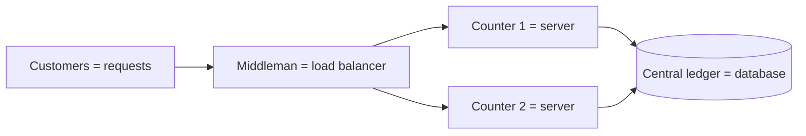
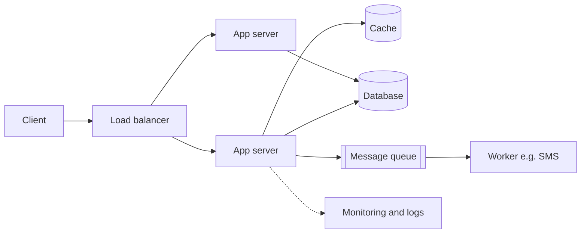
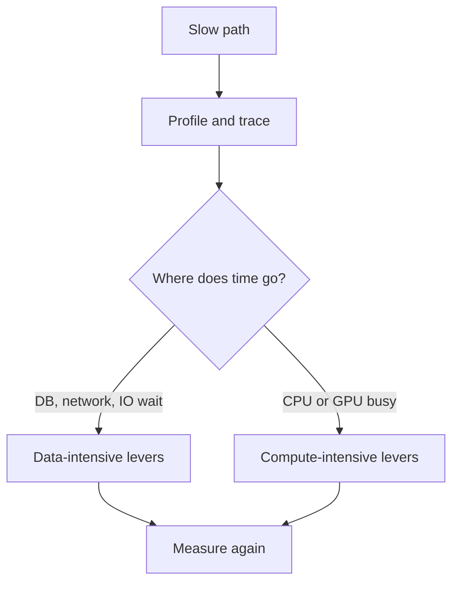

# 🧩 Foundations

*What system design is, the building blocks every design reuses, and the first diagnostic question: is this path data-intensive or compute-intensive?*

## 🧭 What system design is
<!-- related: sd-124 -->

### 🌱 Natural vs built systems
- **Natural systems** (digestive, respiratory) were *discovered*, not built: you can barely change them (surgery at most).
- **IT systems** are *built by engineers*: you pick the components to fit the requirements, load and traffic, and keep improving them.

### 🧱 Definition
- **System = more than one component + a common goal** (one or several use cases serving one purpose).
- **Design = choosing those components** from the requirement analysis of *this* application.
- Code that works for 10 users is programming; making it work for 10M concurrent users (WhatsApp, YouTube, Instagram, Amazon scale) is system design.
- 📚 Primers: [System Design Basics](https://www.geeksforgeeks.org/system-design/system-design-tutorial/), [Introduction to Modern System Design](https://www.educative.io/courses/grokking-the-system-design-interview/introduction-to-modern-system-design?openHLOPage=true), [50 Top System Design Concepts Developers Must Understand](https://levelup.gitconnected.com/50-top-system-design-concepts-developers-must-understand-a9e23f10de4c), 🎥 [System Design Crash Course](https://www.youtube.com/watch?v=Vnm-ycSfJx4&t=204s), 🎥 [Algorithms You Should Know Before System Design Interviews](https://www.youtube.com/watch?v=xbgzl2maQUU&list=PL7Km2bXFj3JoO666RCvBsmNT7VQvRefvo).
- 📚 Levels: [High level Design (HLD)](https://www.geeksforgeeks.org/system-design/what-is-high-level-design-learn-system-design/) vs [Low Level Design (LLD)](https://www.geeksforgeeks.org/system-design/what-is-low-level-design-or-lld-learn-system-design/) — [Difference between HLD and LLD](https://www.geeksforgeeks.org/system-design/difference-between-high-level-design-and-low-level-design/).

> 🔑 Rounds are rarely labelled "system design", but every senior round expects the vocabulary.

## 🏦 The Alien Bank story — five problems, five concepts
<!-- related: sd-52, sd-53 -->

### 🧾 Setup
- One cash counter, one cashier. Customer cycle: visit counter → withdraw/deposit → take receipt → leave.

### 📈 The five issues

| # | Issue | Fix in the bank | Result | Concept |
|---|---|---|---|---|
| 1 | 10 min per customer → **6 customers/hour**; time lost understanding the request, counting cash by hand, writing receipts | Train the cashier to count and type faster — no new resources | **5 min** per customer (50% better) | **Code quality** — better algorithms, LLD, DSA |
| 2 | Traffic keeps growing; cashier at peak | Bigger desk, **cash-counting machine**, **pre-filled forms** | **3 min** per customer | **Vertical scaling** — upgrade the same machine; hard ceiling |
| 3 | Desk and cashier maxed; with 10 queued, the **10th waits 27 min** for 3 min of work | Open **counter 2** | Queue splits | **Horizontal scaling** — add machines |
| 4 | Each counter keeps its own records → a customer withdraws at counter 1 **and again** at counter 2 | Both counters read/write **one central ledger** | Consistent balances | **Central (or properly distributed) database** |
| 5 | Gate is next to counter 1, so counter 2 idles | A **middleman** routes by load: 10 vs 5 → next goes to counter 2 … until **11/11**; if counter 1 breaks, everyone goes to counter 2 | Balanced load + failover | **Load balancer** — health checks + distribution |

### 🔁 Mapping
- Customers = **requests**; the queue = **traffic**.
- Counter = **server**; cashier's work = **application code**.
- Ledger = **database**; middleman = **load balancer**.

> 🔑 Order of levers: fix the code first (free), then scale up (cheap, capped), then scale out (needs shared state and a load balancer).

## 🧱 The seven core components
<!-- related: sd-55, sd-53, sd-56 -->

### 🧅 Why layers exist
- Every app (WhatsApp, Instagram, YouTube, Netflix, Amazon) is about storing and serving **images, video, audio, text**.
- Thought experiment 1: if every user knew **SQL** and the table layout, they could query the DB directly — no app needed. Unrealistic: one LinkedIn page joins many tables. So **application code** hides the DB behind **APIs** (`GET /students`).
- Thought experiment 2: if every user knew **JSON** and how to call endpoints, no front end would be needed. Unrealistic, so a **client** layer exists (web, mobile, even an ATM).
- Layers talk over TCP/IP + HTTP. Because the app exposes APIs, **other servers** can call it too.

### 📦 The seven

| # | Component | Job |
|---|---|---|
| 1 | **Database** | Persist and retrieve data; SQL or NoSQL |
| 2 | **App code on servers** | Business logic; exposes APIs, hides the DB |
| 3 | **Client** | Web, mobile, desktop |
| 4 | **Cache** | Keep hot results so a heavy query (e.g. a **12-table join**) isn't rerun every time |
| 5 | **Load balancer** | **Health checks** + **even distribution** across servers |
| 6 | **Message queue** | Async hand-off with retries; e.g. order placed → inventory, delivery vendor, email/SMS |
| 7 | **Monitoring & logs** | Stack traces to reproduce bugs, regressions from new features, alerts |

- **Sync call** = wait for the other service's answer; **async** = hand it to a queue and move on. The queue retries failures and can report success/failure in batches.

> 💡 A college-project app is client → app → DB with **every request hitting the DB**. Each extra component exists to remove one specific pain; name the pain when you add it.

## ⚖️ Data-intensive vs compute-intensive
<!-- related: sd-125, sd-11, sd-54 -->

### 🔍 The scenario
- Two apps, same users, same network; one is slow. Options: more DBs, more caching, bigger CPU/GPU. **The axis you choose decides whether anything improves.**

| | **Data-intensive** | **Compute-intensive** |
|---|---|---|
| Time goes to | Reading, writing, moving data | Calculating |
| Bound by | DB, network, I/O | CPU / GPU |
| Examples | Instagram feed, chat messages, bank transactions, analytics dashboards, log processing | Image processing, video rendering/transcoding, ML training, simulation, cryptography |
| Worries | How fast can we read? How safely store? How many users on the same data? What if a DB/network/server dies? | How fast can we compute? Can it run in parallel or in the background? GPU instead of CPU? Cost of compute? |
| Levers | Indexes, **caching**, **replication**, **sharding**, CDN, consistency choices | Better algorithms, parallelism, GPUs, async jobs, batching |

### 📸 Worked examples
- **Instagram feed**: fetch posts → sort by time/relevance → show media → like/comment/share. No heavy maths; the challenge is millions reading and writing at once. Scale with multiple DBs, aggressive caching, and a **CDN for media** — the DB stores only the file URL.
- **Flight simulator**: must behave exactly like the aircraft; worries are parallelism, GPU vs CPU, algorithm quality, cost.
- **YouTube is mixed**: serving video is data-intensive; recommendations are compute-intensive. **Classify per feature, not per product.**
- Scale check: WhatsApp has publicly cited on the order of **100 billion messages/day** — a data-movement problem.

> 🔑 Time lost in **data movement** → data-intensive. Time lost in **computation** → compute-intensive. Measure before choosing.

> 📝 Pick three features of an app you use daily and classify each; name one lever for each.

## 🎯 How to open any design round
<!-- related: sd-124 -->

### 🪜 Structure
1. Functional requirements — agree the in-scope subset.
2. Non-functional requirements **with numbers**.
3. Back-of-envelope estimates.
4. High-level design.
5. Deep dive on the bottleneck.
6. Trade-offs and failure modes.

- Think out loud; the interviewer grades trade-offs and component choices, not a perfect answer.
- Design **feature by feature**, then combine.

