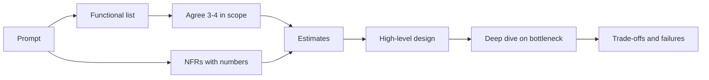

# 📋 Requirements & estimation

*Functional requirements say what the system does; non-functional requirements say how well, in numbers. Estimates turn those numbers into load, storage and bandwidth.*

## 🧾 Functional vs non-functional
<!-- related: sd-124 -->

### 🛒 Amazon as the example

| Functional — *what it does* | Non-functional — *how well* |
|---|---|
| Register | **1M daily active users** |
| Log in | Response time **< 200 ms** per request (say how fast, not "fast") |
| See products | Availability **99.9%**, backed by an SLO/SLA |
| Search products | **Encrypt** data in transit and at rest |
| Filter products | Handle **10× traffic** on sale days (Black Friday, Diwali, Holi sales) |
| Add to cart | **Fault tolerant** — faults will happen; detect and recover fast |
| Apply coupons / discounts | |
| Place order | |
| Make payment | |
| Track order | |

### ✂️ Scope it
- In 45 minutes agree **3–4 features** (e.g. search, cart, checkout) and explicitly park the rest.
- Horizontal vs vertical scaling is **not** a requirement — it's the design choice that meets the scale requirement.

> 📝 For Instagram, YouTube, Netflix or WhatsApp, write 3–4 functional and 3–4 non-functional requirements, each NFR with a number.

## ✅ The NFR checklist
<!-- related: sd-124, sd-11 -->

### 📋 What to state

| NFR | What to say |
|---|---|
| **Scalability** | Target load (DAU, peak rps, growth, spike multiplier) |
| **Availability** | Uptime target per path, e.g. 99.9% browse, 99.99% checkout |
| **Reliability / durability** | No acknowledged write lost |
| **Performance** | Latency as **percentiles**: p50 / p90 / p95 / p99 |
| **Consistency** | Per feature — strong for inventory and money, eventual for feeds and reviews |
| **Security** | Authentication, authorisation, encryption |
| **Maintainability** | Clean modules and APIs so parts change independently |
| **Observability** | Monitoring, logging, tracing after launch |

> 🔑 An NFR without a number can't drive a design decision and can't be checked.

## 📏 SLI, SLO, SLA and the nines
<!-- related: sd-124 -->

### 🧮 Three terms

| Term | Is | Example |
|---|---|---|
| **SLI** | The measured number | 99.95% of requests succeeded this month |
| **SLO** | The internal target | 99.95% success; p99 < 200 ms |
| **SLA** | The external contract, with penalties | 99.9%, or service credits are paid |

- SLA is **looser** than the SLO so you breach your own target before the contract.
- A provider that breaches a written SLA owes credits or faces legal claims.

### 9️⃣ Downtime budget

| Availability | Per year | Per month (30 d) |
|---|---|---|
| 99% | ~3.65 days | ~7.2 h |
| 99.9% | ~8.8 h | ~43 min |
| 99.99% | ~53 min | ~4.3 min |
| 99.999% | ~5 min | ~26 s |

- Each extra nine costs roughly 10× in redundancy and operations; ask whether the business needs it.

## 📊 Percentiles, not averages
<!-- related: sd-122 -->

### 🧪 Why
- Ten response times averaging **6.8 s** can have **p50 = 4 s** and **p90 = 12 s**: the average describes no real user.
- **pN** = N% of requests finish within that time. p99 is what your heaviest users feel (they make the most requests).
- A wide p50 → p90 gap points at a slow subset: find those endpoints.
- Percentiles don't average across servers — merge histograms.

## 🧮 Back-of-envelope estimation
<!-- related: sd-11, sd-124 -->

### 🪜 Method
1. Users: DAU and peak concurrency.
2. Actions per user per day → requests/day.
3. ÷ **~86,400 s** (round to **10^5**) → average rps; × **2–3** for daily peak; × spike factor.
4. Read : write ratio.
5. Storage = writes/day × record size × retention.
6. Bandwidth = rps × response size.

### 🛒 Worked example — Amazon-style NFRs

| Step | Calculation | Result |
|---|---|---|
| Requests/day | 1M DAU × 20 requests | 20M/day |
| Average rps | 20M ÷ 86,400 | ~230 rps |
| Daily peak | × 3 | ~700 rps |
| Sale day | × 10 of peak | ~7,000 rps |
| Orders/day | 5% of DAU buy | 50,000 |
| Order storage | 50,000 × 2 KB | ~100 MB/day ≈ 36 GB/yr |
| Browse bandwidth | 7,000 rps × 50 KB | ~350 MB/s at sale peak |

- Conclusions to say out loud: order writes are tiny — one relational primary handles them; reads dominate, so cache product pages and put images on a CDN; plan autoscaling for 10×.

> 💡 Keep one significant figure; the goal is order of magnitude, spoken arithmetic, and a design conclusion.

> 📝 Estimate rps and yearly storage for a chat app: 10M DAU, 40 messages/user/day, 200 bytes each.

## 🎬 Opening the interview
<!-- related: sd-124 -->

### ⏱️ Time box
- 0–8 min: requirements and numbers. 8–12: estimates. 12–25: high-level design. 25–40: deep dive. 40–45: trade-offs and what you parked.
- Every major box in the final diagram should trace back to an NFR.

