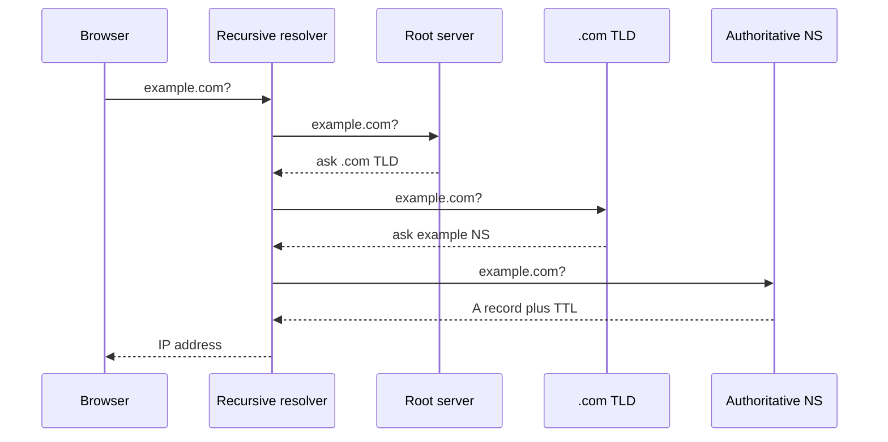
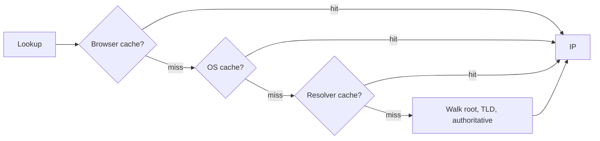

# 🌐 DNS

*The Domain Name System turns a human name like example.com into the IP address machines use — a hierarchical, delegated, heavily cached lookup with no single central table.*

## ❓ Why DNS exists
<!-- related: sd-45 -->

### 🏷️ Names vs addresses
- Humans use names (`example.com`); machines route by **IP address**. Something must translate.
- **Domain**: `example.com`, `google.com`. **Subdomain**: `docs.example.com`, `courses.example.com` — the domain is the umbrella.

### 🚫 Why not a table in the browser or on one server?
- **350M+ registered domains**; the browser can't know which ones you'll visit, and holding them all makes it heavy and slow.
- **IPs change** (e.g. moving hosting); every browser would need updating.
- **One central server** would be overloaded and a single point of failure: if it died, the whole internet would stop resolving.
- Answer: a **hierarchy** where each level only knows who to ask next, plus **caching** with expiry.

## 🧭 The resolution walk
<!-- related: sd-45 -->

### 🚶 First visit to example.com
1. Browser → OS stub resolver → **recursive resolver** (usually the ISP's; the home router may forward to it; or a public one like 8.8.8.8).
2. Resolver → **root server**: "I don't know example.com, but here are the **.com TLD** servers."
3. Resolver → **.com TLD server**: "Here are the **authoritative name servers** for example.com."
4. Resolver → **authoritative server** (configured at the DNS host, e.g. GoDaddy or Hostinger): returns the **A/AAAA record** — the IP.
5. Resolver caches it and returns it; the browser opens a TCP/TLS connection to that IP.

### 🔁 Recursive vs iterative
- **Recursive** query: client → resolver — "give me the final answer".
- **Iterative** queries: resolver → root → TLD → authoritative — each returns a **referral** to the next level.

## 🌳 Root, TLD and authoritative servers
<!-- related: sd-45, sd-54 -->

### 🌍 Root
- **13 root identities, named A to M**, run by **12 operators**.
- Each identity is served by many machines worldwide via **anycast** — one IP advertised from many locations, routed to the nearest. Well over a thousand instances in total, so "13 servers" is not 13 machines.

### 🏢 TLDs
- Generic: `.com`, `.net`, `.org`, `.gov`, `.edu`. Country-code: `.in`, `.uk`, `.us`.
- A TLD server knows which **name servers are authoritative** for each domain under it (NS records).

### 📘 Authoritative
- Holds the real records for a domain: **A** (IPv4), **AAAA** (IPv6), **CNAME** (alias), **MX** (mail), **TXT**, **NS**.
- A CDN typically plugs in here: a CNAME points your name at the CDN, which answers with a nearby edge IP.

## ⏱️ Caching and TTL
<!-- related: sd-45 -->

### 🗃️ Three cache layers
- **Browser** cache.
- **OS** cache (stub resolver).
- **Recursive resolver** cache — shared by all its users, so popular domains are almost always hot.
- The full root → TLD → authoritative walk happens only on a miss.

### ⌛ TTL
- Every record carries a **TTL**; every cache drops the record when it expires.
- Short TTL (60 s) = fast failover and migrations, more queries. Long TTL (1 day) = fewer queries, slow changes.
- Before a migration, **lower the TTL** a day ahead, switch, then raise it again.

> 🔑 DNS changes are not instant; they propagate as old TTLs expire.

## 🗺️ Zones, subdomains, registrar vs hosting
<!-- related: sd-45 -->

### 🧩 Zones
- A **zone** is the set of records one authoritative server set manages — e.g. `example.com` and its subdomains.
- `courses.example.com`: root → `.com` TLD → example's authoritative servers, which look up `courses` in the **example.com zone**.
- A subdomain can also be **delegated** to different name servers with its own NS records.

### 🏪 Registrar vs DNS hosting vs web hosting

| Role | Does | Changing it changes your IP? |
|---|---|---|
| **Registrar** | Registers the name and sets which NS are authoritative | No |
| **DNS hosting** | Runs the authoritative servers and records | No, unless records change |
| **Web hosting** | Runs the servers the A record points to | **Yes** — update the A record |

