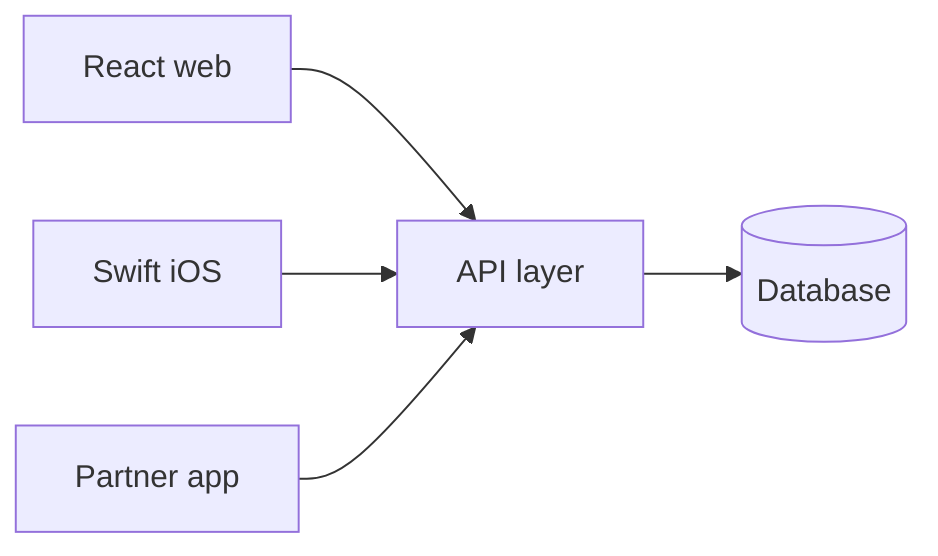
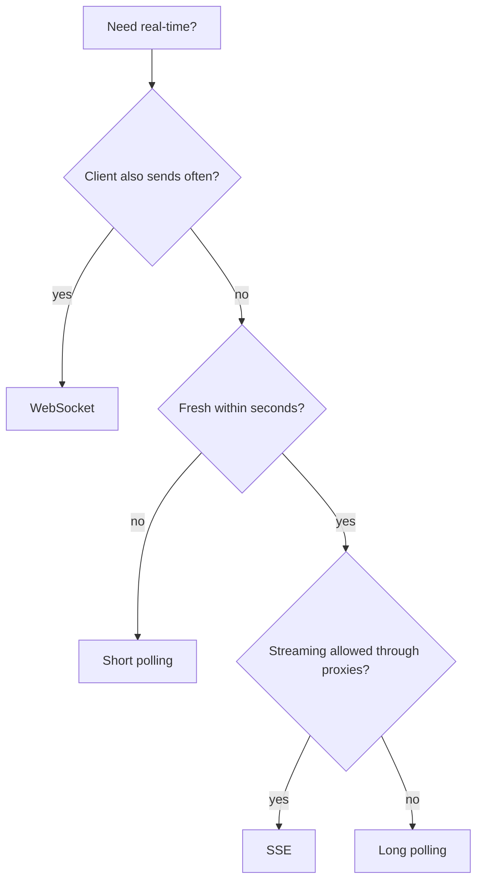
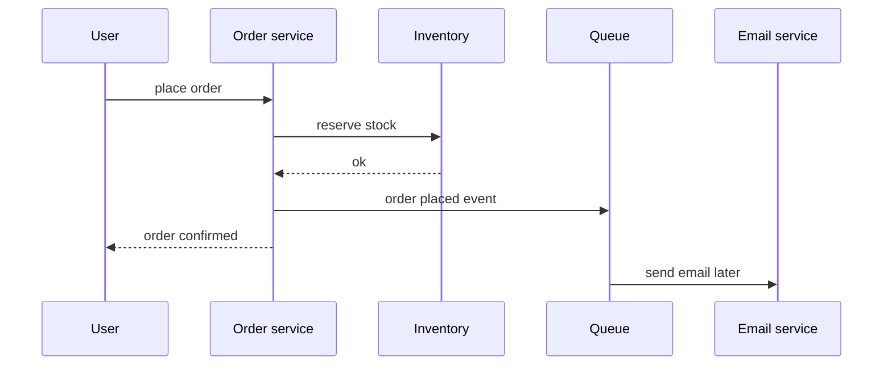

# 🔌 APIs & communication styles

*An API is the contract one application exposes so others can use its data and actions without touching its internals. Pick the style by who calls it, how often, and who needs to start the conversation.*

## 🤝 What an API is
<!-- related: sd-120, sd-44 -->

### 🗺️ Using someone else's system
- Zomato, Uber, Ola, Rapido and Swiggy show maps without building a mapping engine: they call **Google Maps APIs**.
- **API = Application Programming Interface**: the endpoints an application exposes for others.

### 🎬 Use case 1 — other applications
- A movie-ratings app (IMDb / Rotten Tomatoes style) already holds decades of films, ratings and reviews.
- A third party calls its **read APIs** instead of re-curating everything, and its **"write a review"** endpoint instead of building one.

### 📱 Use case 2 — your own front ends
- One back end, many clients: a **React** web app and a **Swift** iOS app consume the same APIs.
- Clients don't care what language the back end is written in; the API is the contract.
- Some APIs are private to your own clients; others are opened to partners. Both can coexist.

### 🔒 Why never expose the database
- The caller would have to understand every table and query path.
- One bad or malicious query can **delete or corrupt data** other apps depend on.
- No place to enforce auth, validation, rate limits, or to change the schema later.

## 🧰 The five API styles
<!-- related: sd-44, sd-43 -->

### 📊 Comparison

| Style | Format / transport | Key idea | Best for |
|---|---|---|---|
| **REST** | JSON over HTTP; resources + verbs | Simple, cacheable, most widely used | Public and client-facing APIs |
| **SOAP** | XML envelopes, strict contracts (WSDL) | Verbose — tags repeated for every field | **Legacy** enterprise systems; bridge with a middleware that converts XML ↔ JSON |
| **GraphQL** | JSON over HTTP, **single endpoint** | Client sends a typed **field-selection query** over a schema; gets exactly those fields | Many clients with different screens; avoids over- and under-fetching |
| **gRPC** | **Protocol Buffers** over **HTTP/2** | Binary, schema-first, much smaller than JSON; streaming; created by Google | **Internal service-to-service** calls where latency matters |
| **WebSockets** | Persistent full-duplex connection | After the handshake **either side can send** — the server can push | Chat, notifications, live quizzes, collaboration |

### 🧠 Precise points
- GraphQL is **not SQL-like**: it selects fields from a typed schema; it does not join or aggregate — resolvers do that work server-side.
- GraphQL loses easy HTTP caching (one POST endpoint) and needs query cost limits.
- gRPC needs HTTP/2 end to end; browsers need **gRPC-Web** or a gateway.
- Live-quiz example: scores depend on **response time + correctness**, and results, notifications and GIFs are pushed live — a WebSocket fit.

> 🔑 Common split: REST (or GraphQL) at the edge for clients, gRPC inside between microservices.

## ⏱️ Real-time transports
<!-- related: sd-121, sd-62 -->

### 🔄 Four options

| Transport | How it works | Latency | Cost | Use when |
|---|---|---|---|---|
| **Short polling** | Client asks every N s | Up to N s | Many empty responses | Badges, dashboards refreshed every ~30 s |
| **Long polling** | Server holds the request until data or ~30 s timeout; client re-asks | Near real time | One request per message + held connection | Fallback when streaming is blocked |
| **SSE** | One long HTTP response streaming `text/event-stream`, server → client only | Real time | One connection; auto-reconnect with `Last-Event-ID` | Tickers, live scores, feeds |
| **WebSockets** | Upgraded TCP connection, both directions | Real time | Stateful; needs sticky gateways and heartbeats | Chat, games, collaboration |

- WebSockets and SSE both run over **TCP**; UDP-based real-time (games, calls) uses WebRTC or QUIC.
- Backgrounded mobile apps lose sockets; use push notifications (FCM/APNs) there.

## 🔀 Sync vs async calls
<!-- related: sd-56 -->

### 📦 E-commerce order

| Task | Mode | Why |
|---|---|---|
| Update inventory | **Sync** | The last unit must be out of stock immediately |
| Email confirmation | Async | A minute late is fine |
| Notify delivery partner | Async | Another service's job |
| SMS / WhatsApp | Async | Same |

- **Sync**: caller waits for the answer — needed for money, security checks, and steps the next step depends on.
- **Async**: caller hands work to a **message queue** and moves on — the queue buffers, retries, and absorbs a slow or down consumer.
- Rule: if you can **fire and forget**, go async. OTP timers are usually **> 30 s** because delivery is async.
- Queues deliver **at least once**, so consumers must be **idempotent**.

