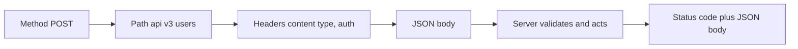
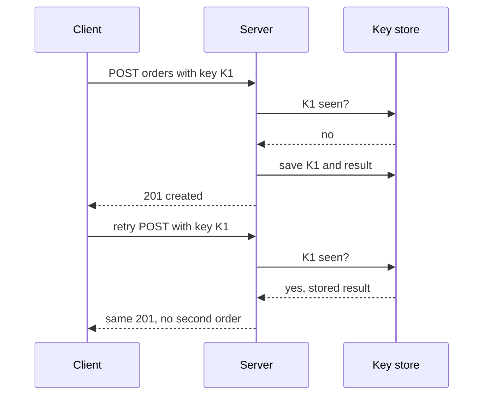

# 🛣️ REST API design

*Resources as plural nouns, HTTP methods as verbs, identifiers in the path, filters in the query, payloads in the body, honest status codes, and responses wrapped so they can grow.*

## 🧱 JSON and URL anatomy
<!-- related: sd-120 -->

### 📄 JSON
- Objects `{}` of key–value pairs and arrays `[]`: `{"name": "Alice", "age": 25}`.
- Values: **string, number, boolean, object, array, null**. Use `null` for an absent value and let the client handle it.

### 🔗 Endpoint = method + path
- `https://mysite.com/api/v1/users`
  - `api` groups the APIs; `v1` is the **version**; `users` is the **resource** (product, coupon, user…).
- In discussion, "`users`" implies the full URL.
- Resource names are **plural nouns**; the method is the verb — never `/getUser` or `/deleteUser/5`.

### 🏷️ Versioning
- URL version (`/v1`, `/v3`) is the most visible; header versioning is the alternative.
- Within a version, only **additive** changes; breaking changes get a new version and a deprecation window.

## ✏️ CRUD and PUT vs PATCH
<!-- related: sd-120 -->

### 🗂️ CRUD mapping

| Goal | Method | Path | Success |
|---|---|---|---|
| List users | `GET` | `/users` | 200 |
| One user | `GET` | `/users/1` | 200 / 404 |
| Create | `POST` | `/users` + body | 201 + new resource |
| Replace | `PUT` | `/users/1` + full body | 200 or 204 |
| Partial update | `PATCH` | `/users/1` + changed fields | 200 or 204 |
| Delete | `DELETE` | `/users/1` | 204 (or 200) |

### 🔁 PUT vs PATCH worked example
- Stored: `{"id": 1, "name": "Alex", "username": "ash", "age": 25}`. Goal: username `ash` → `ak`.
- `PUT /users/1` with `{"username": "ak"}` **replaces the whole resource**: `name` and `age` reset to default/null.
- `PUT` must send the full object: `{"name": "Alex", "username": "ak", "age": 25}`.
- `PATCH /users/1` with `{"username": "ak"}` changes only that field. Use PATCH for partial updates.

### ♻️ Idempotency
- **GET, PUT, DELETE** are idempotent — repeating them leaves the same state. **POST** is not. **PATCH** need not be (e.g. "increment").

## 🪆 Nesting vs query params
<!-- related: sd-120, sd-5 -->

### 📝 Blog with users, blogs, comments
- A comment always belongs to one blog and one author.
- Comments on a blog: `GET /blogs/{blogId}/comments`.
- Comments by a user: `GET /users/{userId}/comments`.
- One comment directly: `PATCH` / `DELETE /comments/{commentId}` — no need to nest once you have its id.
- Weaker alternatives for a direct parent–child read: `blogId` in a body sent to `/comments`, or `GET /comments?blogId=…`.

### ⚖️ Rule
- **Nest** when the relationship is clear and direct, one level deep.
- Use **query params** for filtering, sorting, search, pagination and multi-criteria lists (colour, price range) — deep paths explode combinatorially.

### 📍 Where each piece of data goes

| Place | Holds | Example |
|---|---|---|
| **Path** | The identity: id or slug | `/blogs/what-is-java` |
| **Query** | Sort, filter, search, page | `/blogs?sort=desc`, `/blogs?q=java` |
| **Body** | Payloads and anything sensitive | `POST /login` with username + password |
| **Headers** | Metadata: auth, content type, idempotency key | `Authorization: Bearer …` |

- HTTPS encrypts path, query and body alike. Secrets still stay **out of URLs** because URLs land in server logs, browser history, proxies and `Referer` headers.

## 📨 Request anatomy and status codes
<!-- related: sd-120 -->

### 🧩 A full request
```http
POST /api/v3/users HTTP/1.1
Content-Type: application/json
Authorization: Bearer <token>
Idempotency-Key: 7f3c-...

{"username": "ak", "name": "Alex", "age": 25}
```



### 🚦 Status codes

| Code | Name | Use for |
|---|---|---|
| 200 | OK | Success with a body |
| 201 | Created | New resource created; return it or its location |
| 204 | No Content | Success, nothing to return (often DELETE) |
| 301 / 308 | Moved Permanently | Permanent redirect (308 keeps the method) |
| 302 / 307 | Found / Temporary Redirect | Temporary redirect (307 keeps the method) |
| 400 | Bad Request | Malformed body, missing required field |
| 401 | Unauthorized | **Not authenticated** — no or invalid credentials |
| 403 | Forbidden | **Authenticated but not permitted** — e.g. a paid LMS lesson you're not enrolled in |
| 404 | Not Found | Wrong URL or no such resource |
| 409 | Conflict | State conflict: duplicate username, delete blocked by dependent rows |
| 422 | Unprocessable Content | Well-formed but fails validation rules |
| 429 | Too Many Requests | Rate limited |
| 500 | Internal Server Error | The server failed — log it, hide internals from the client |

> 🔑 4xx = the client must change something; 5xx = the server failed. Bad input is never a 500.

## 📦 Responses, idempotency keys, pagination
<!-- related: sd-120, sd-5 -->

### 🗺️ Request → response map

| Request | Responses |
|---|---|
| `GET /users` | 200 + `{"users": [...]}` |
| `GET /users/1` | 200 + `{"user": {...}}`; 404 if missing |
| `POST /users` | 201 + created user; 400/422 bad body; 409 duplicate |
| `DELETE /users/1` | 204; 404 if missing; 403 not permitted; 409 dependent records |

### 🎁 Always wrap in an object
- `{"users": [ ... ]}`, not a bare `[ ... ]`; `{"user": { ... }}` for one item.
- Later you can add `"userCount": 29` or `"next_cursor"` **without breaking** clients; a bare array can't grow.
- Errors get one consistent envelope: `{"error": {"code": "USERNAME_TAKEN", "message": "..."}}`.

### 🔑 Idempotency keys

- Client generates a UUID per logical operation; server stores key → response for ~24 h.

### 📄 Pagination

| Style | Request | Pros | Cons |
|---|---|---|---|
| Offset | `?page=3&limit=20` | Simple, jump to page N | Slow on deep pages; rows shift on inserts → duplicates/skips |
| Cursor | `?cursor=abc&limit=20` | Stable under inserts, fast (index seek) | No random page jump |

- Feeds and infinite scroll → cursor; admin tables → offset is fine.

