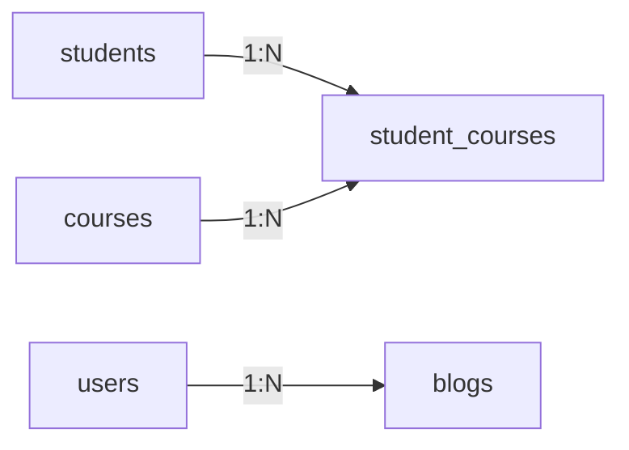

# 🗃️ SQL & relational modelling

*Relational databases store entities as tables of rows and columns, enforce correctness with constraints, link tables through keys, and guarantee ACID transactions.*

## 🧱 Tables, rows, columns
<!-- related: sd-46 -->

### 💾 Why a database at all
- Data held only in server memory is lost on restart; a DB **persists** what users need next time.
- "SQL vs NoSQL" is like "Java vs no-Java": NoSQL is many different models (key-value, wide-column, graph, document).
- **SQL** = Structured Query Language over an **RDBMS**. Common engines: **PostgreSQL**, **MySQL**.

### 📐 Anatomy
- **Table ≈ entity**: `users`, `posts`, `comments`, `videos`.
- **Column = attribute**: `users(id, first_name, last_name, phone)`.
- **Row = one record**: `1, Alice, Agarwal, 98765…`.
- **Naming**: plural table names (`users`, not `user`) because a table holds many records — a convention, not a rule; pick one and stay consistent.

## 🛡️ Constraints
<!-- related: sd-46 -->

### 📋 The six
Forms validate in the UI, but the **database is the last line of defence** — faulty data is useless.

| Constraint | Meaning | Example |
|---|---|---|
| **PRIMARY KEY** | Unique, non-null identifier; `WHERE id = 3` returns exactly one row | `users.id` |
| **UNIQUE** | Value can't repeat in the column | `username`: if "abc" exists nobody else can insert "abc"; Instagram/Gmail then suggest variants with extra characters |
| **NOT NULL** | Value is mandatory | `first_name`, since the app addresses users by it |
| **CHECK** | Value must satisfy a rule | `phone` digits only; `LENGTH(first_name) >= 2` (2-letter names exist) |
| **DEFAULT** | Filled when nothing is supplied | `plan = 'free'` until they pay; `role = 'student'`, later updated to `'trainer'` if hired |
| **FOREIGN KEY** | References another table's primary key | `posts.author_id → authors.id` |

### 🔐 Passwords are validated in the app
- The DB stores only a **salted hash** (bcrypt / Argon2), so a `CHECK` on the stored column can't see length, digits or special characters.
- Enforce password rules in the application **before hashing**.

```sql
CREATE TABLE users (
  id          BIGSERIAL PRIMARY KEY,
  username    VARCHAR(30) NOT NULL UNIQUE,
  first_name  VARCHAR(50) NOT NULL CHECK (LENGTH(first_name) >= 2),
  phone       VARCHAR(15) CHECK (phone ~ '^[0-9]+$'),
  plan        VARCHAR(10) NOT NULL DEFAULT 'free',
  role        VARCHAR(10) NOT NULL DEFAULT 'student',
  pw_hash     TEXT NOT NULL
);
```

## 🔗 Relationships
<!-- related: sd-46 -->

### 1️⃣➡️🔢 One-to-many / many-to-one
- `users(1 Alice, 2 Bob)`; `blogs(HTML → 1, AI → 2, System Design → 1)`.
- One user has many blogs (1:N); read from the blog side, many blogs belong to one user (N:1).
- The foreign key lives on the **many** side (`blogs.user_id`). Store the id, never copy the author's details.

### 🔢↔️🔢 Many-to-many
- `students(Alice, Bob)` ↔ `courses(Master Java, Master AI)`.
- Needs a **junction table** `student_courses(student_id, course_id)` — primary key on the pair, or its own id if queries need it.

| student_id | course_id |
|---|---|
| Alice | Master Java |
| Alice | Master AI |
| Bob | Master Java |
| Bob | Master AI |



### 1️⃣↔️1️⃣ One-to-one — content split
- Platform with three heavy content kinds: **blog text, audio (MP3), video (MP4)**.
- One fat `contents` table with every column for every type gets huge and every filter scans all types.
- Better: a slim `contents(id, name, type, content_id, keywords, slug)` for search and listing; payloads live in `blogs`, `audios`, `videos`.
- `type = video, content_id = 1` → exactly one row in `videos` where `id = 1`: one-to-one.

## ⚛️ ACID transactions
<!-- related: sd-46, sd-50 -->

### 🧪 The four guarantees

| Letter | Means | Example — transfer ₹100 |
|---|---|---|
| **Atomicity** | All or nothing | Debit and credit both happen or neither |
| **Consistency** | Constraints hold before and after | Balance never violates `CHECK (balance >= 0)` |
| **Isolation** | Concurrent transactions don't see each other's partial work | Two withdrawals can't both read the old balance (isolation level decides how strictly) |
| **Durability** | Committed data survives a crash | Write-ahead log flushed before "OK" |

- ACID's C (constraints) is not CAP's C (every read sees the latest write).
- Isolation levels trade safety for throughput: read committed → repeatable read → serializable.

## 📇 Indexes
<!-- related: sd-47 -->

### ⚡ Basics
- Without an index a filter is a **full table scan**; an index (usually a **B-tree**) finds rows in O(log n).
- Primary keys and UNIQUE columns are indexed automatically; index foreign keys and frequent filter/sort columns yourself.
- **Composite index** `(user_id, created_at)` serves `WHERE user_id = ? ORDER BY created_at` — column order matters (leftmost prefix).
- Cost: every index slows writes and uses storage. Index for real queries, confirm with `EXPLAIN`.

