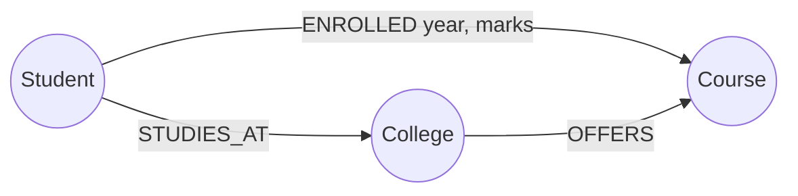

# 🗂️ NoSQL families

*NoSQL is a family of non-relational models — key-value, wide-column, graph, document — each fast for the access pattern it was modelled around, and weaker outside it.*

## ❓ Why NoSQL exists
<!-- related: sd-46 -->

### 😣 Relational pain at scale — a blog
- `posts(id, content, content_type)` where content is image, text or video → separate `images`, `videos`, `texts` tables.
- `comments(id, comment, parent_comment_id, post_id, user_id)` and `users(id, name)`.
- About **6 tables plus relationships** for a small blog; rendering one post means several joins.
- Scaling: vertical (4 GB → more) has a ceiling; horizontal means keeping cross-table relationships and transactions correct across machines — hard.

### ✅ What NoSQL offers
1. **Easy horizontal scaling** — a self-contained record can be **partitioned** and **replicated** across nodes without cross-node joins.
2. **Flexible schema** — one `content` collection can hold differently shaped records:
   - `{user_id: 1, content: "https://….jpg"}`
   - `{user_id: 2, content: "some text"}`
   - `{user_id: 3, heading: "Java", description: "…"}`
3. **Nesting instead of joins** — key `course_id` → a course with nested lessons, each with nested comments; one read returns it all.

> 🔑 "Schemaless" means the schema lives in the application; it still exists and still needs versioning.

## ⚖️ SQL vs NoSQL — choosing
<!-- related: sd-46, sd-50 -->

### 📊 Decision table

| Factor | Lean SQL | Lean NoSQL |
|---|---|---|
| Data shape | Fixed, well-known entities | Varied or evolving per record |
| Relationships | Many, queried in different ways (joins) | Few; data read as one aggregate |
| Transactions | Multi-row ACID required (payments, inventory) | Single-record atomicity is enough |
| Queries | Ad-hoc filters, joins, aggregates | Known access patterns: get by key, one partition |
| Scale | Fits one primary + replicas, or sharded SQL | Very high write volume, easy horizontal scale |
| Consistency | Strong by default | Tunable — often eventual, strong available per read in many engines |

### 🧠 Nuances
- NoSQL is fast **for the access pattern it was modelled for** (lookup by key, one document), not universally; ad-hoc joins and aggregates are weak.
- Relational databases shard too (Vitess, CockroachDB, Spanner).
- "SQL = consistency, NoSQL = availability" is a heuristic: DynamoDB offers strongly consistent reads, MongoDB majority writes.
- Real systems are **polyglot**: orders in Postgres, sessions in Redis, activity in Cassandra.

### 🏢 Commonly cited uses

| Company | Store | Commonly cited for |
|---|---|---|
| Netflix | Apache Cassandra | Viewing / user-activity data |
| Amazon | DynamoDB | High-scale key-value workloads |
| Meta | HBase | Messaging storage (historically) |
| Uber | MongoDB | Flexible real-time data |
| Twitter / X | Redis | Caching and timelines |

## 🔑 Key-value stores
<!-- related: sd-55, sd-64 -->

### 🧰 Model
- A **unique key** → an opaque value: string, number, JSON, blob, byte array, list of objects.
- No schema, **no relationships**: `post1 → {post_id, post_content, comments: [{comment_id, content}, …]}` — no join tables.
- The shape of caches, sessions, cookies and browser storage.
- Examples: **Redis**, **Memcached**, **DynamoDB** (key-value with optional sort key).

### ⚖️ Trade-offs
- O(1) get/put by key, trivial to partition by hashing the key.
- No query by value unless you build secondary indexes yourself.

## 🧮 Wide-column vs columnar analytics
<!-- related: sd-46, sd-47 -->

### 📊 Two different things

| | **Wide-column NoSQL** | **Columnar analytical warehouse** |
|---|---|---|
| Examples | **Cassandra**, **HBase**, Bigtable | **BigQuery**, **Redshift**, **Snowflake** |
| Query language | CQL / API, no joins | **SQL** |
| Storage | Rows grouped by **partition key**, sorted by clustering key, in column families | Each **column stored separately**, heavily compressed |
| Optimised for | **High write throughput**, key-range reads at scale | **Scans and aggregates** over billions of rows |
| Writes | Very fast (log-structured, LSM) | Batch loads; single-row writes slow |
| Use | Activity feeds, time series, messaging | Dashboards, reporting, BI |

### 🎓 The class-average example (columnar analytics)
- `students(id, name, marks)` with rows `1 Alice 90`, `2 Bob 95`.
- Row storage reads each whole row — `name` included — to average `marks`; with 17 columns it reads all 17.
- Column storage reads **only the `marks` column**, aggregates it, and re-links to other columns by position/id.
- Great for reads and analytics; slower for single-row writes, which touch every column file.

## 🕸️ Graph databases
<!-- related: sd-46 -->

### 🕵️ The detective board
- Photos pinned on a board = **nodes**; threads between them = **edges** (relationships).
- **Both nodes and edges carry properties**:
  - `Student —ENROLLED→ Course` with `year`, `marks`, `year_of_passing` on the edge.
  - `Student —STUDIES_AT→ College`, `College —OFFERS→ Course`.
- Two nodes can have several relationships; paths through other nodes are first-class.

### 🔎 Querying
- **Cypher** (Neo4j), **Gremlin** (Apache TinkerPop), **SPARQL** (RDF stores).
- Strength: multi-hop traversals ("friends of friends who bought X") without chains of joins.
- Uses: social graphs, recommendations, fraud rings, knowledge graphs, customer-behaviour analysis.
- Weakness: harder to partition; bulk scans and simple lookups are slower than in other stores.
- Graph databases are a storage model; **GraphQL** is an API style — unrelated.

## 📄 Document databases
<!-- related: sd-46 -->

### 🧾 Model
- JSON/BSON documents of any shape in a collection; nested objects and arrays; indexes on any field.
- Examples: **MongoDB**, **CouchDB**, Firestore.

### 🧰 Good fits
- **Logging** — errors, warnings, arbitrary context fields.
- **User profiles** — some users fill every field, some a few.
- **Content** — image, video and text posts in **one collection** with different attributes.
- Catalogs with per-category attributes.

### ⚖️ Trade-offs
- One read returns the whole aggregate; secondary indexes support queries by field.
- Embed what's read together and bounded; **reference** what's unbounded or shared (e.g. millions of comments).
- Cross-document transactions exist in some engines but cost more than in SQL.

