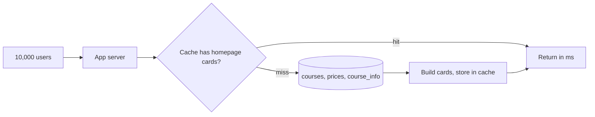
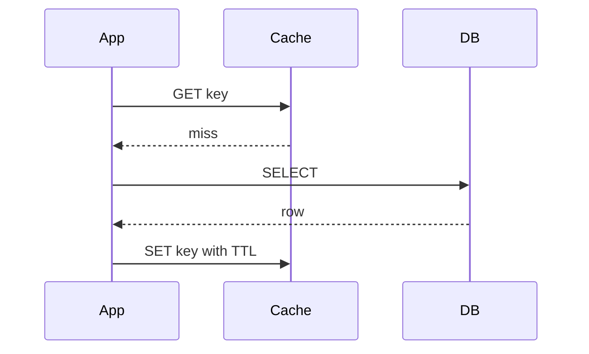
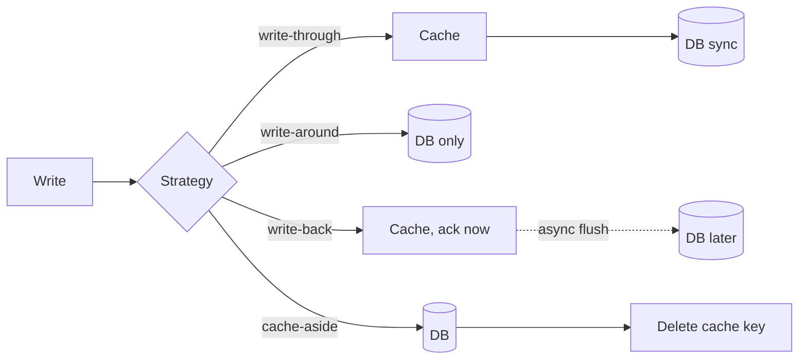
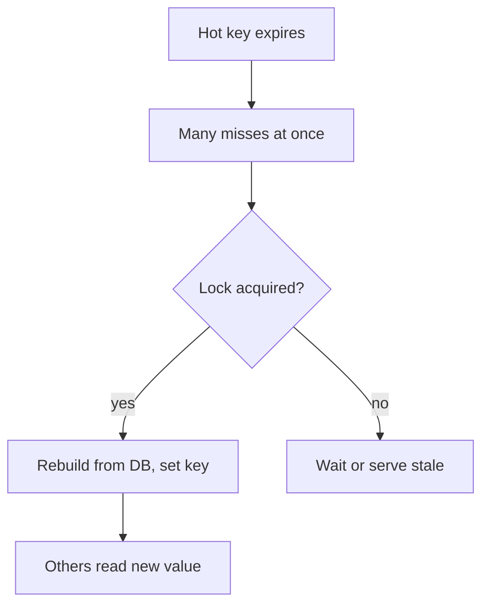

# ⚡ Caching

*A cache is a small, fast store of hot data kept in front of a slower source. The design questions are where it lives, how it's filled and written, how it stays fresh, and what it evicts.*

## 🏠 Why cache — the homepage example
<!-- related: sd-55, sd-7 -->

### 🧮 The numbers
- A course site's homepage shows **3 popular courses**. Each card needs:
  - **thumbnail** — from the CDN;
  - **name** — from `courses`;
  - **price + discounted price** — from `prices` (varies by locality/currency);
  - **key sections** — from `course_info`.
- That's **4 fetches per course** (3 tables + CDN), for **every user on every visit**.
- **10,000 DAU** × those fetches, and growing to **6 courses** → 6 × 4 = **24 requests per user visit** — about **60,000 course-name reads a day** alone, for data that barely changes.
- Result: slow homepage, poor performance, lost sales.

### ✅ The fix
- Compute the six course cards once, store them in memory, serve every visitor from there.

## 📍 Where caches live
<!-- related: sd-7, sd-54, sd-55 -->

### 🧅 Layers

| Layer | Example | Caches |
|---|---|---|
| **Client** | Browser HTTP cache, mobile memory/disk cache | Images, API responses, static assets |
| **CDN / edge** | Edge servers near users | Media, static files, cacheable GETs |
| **Server-side** | Redis / Memcached, in-process LRU | Query results, sessions, rendered fragments |
| **Database** | Buffer pool, query cache | Hot pages and index blocks |

- Each layer closer to the user saves more latency but is harder to invalidate.

## 🎯 Hit, miss, TTL — and why caches are small
<!-- related: sd-55, sd-114 -->

### 📖 Terms
- **Hit** — found in cache → no DB call, fast.
- **Miss** — not found → read the DB, usually fill the cache, slower.
- **TTL** — how long an entry lives before it **expires**.
- Storage is **key → value + TTL**; expired or evicted pairs make room.
- **Hit ratio** = hits ÷ lookups — the metric that tells you whether the cache earns its cost.

### 🤏 Why not cache the whole DB?
- Memory is expensive; the cache is fast and cheap **because it holds only the hot subset**.
- Hot data shifts: today's featured course is Master **Java**; tomorrow the campaign moves to **AI** — the cache must follow.
- A cache as big as the DB costs as much as a second DB and still has to be kept in sync.
- So: **cache ≪ DB**, sized to the working set, continuously refreshed.

## ✍️ Read and write strategies
<!-- related: sd-55, sd-64 -->

### 📊 Comparison

| Strategy | Write path | Read path | Trade-off | Example |
|---|---|---|---|---|
| **Cache-aside** | App writes DB, then **deletes** the key | App checks cache; on miss app reads DB and fills cache | Most common; app controls everything; survives cache outage | General-purpose |
| **Read-through** | Writes go to DB | Cache itself loads from DB on a miss | Library/provider does the loading; cache holds only data actually read | Product details |
| **Write-through** | Write to cache, cache writes DB **synchronously** | From cache | Cache always current; every write pays both latencies | **Stock prices**, anything needing the latest value |
| **Write-around** | Write **only to DB**, bypass cache | Read-through / cache-aside on miss | New data isn't cached until someone reads it; first read misses | **Tweets**: don't cache at creation; cache when read, because then others will read it too |
| **Write-back** | Write to cache, **ack immediately**, flush to DB **asynchronously** | From cache | Fastest writes; risk of **losing data** if the cache dies before flush | **Food-delivery order status**: millions of rapid updates, users read from cache, DB catches up |

### 🔁 Cache-aside read path

### ✏️ Write paths side by side

> 🔑 Write-around = DB-only writes + read-through reads. Write-through = writes go via the cache. They're opposites.

## 🧹 Invalidation and stampedes
<!-- related: sd-55, sd-64 -->

### 🔄 Keeping data fresh
- **TTL** — simplest; bounded staleness.
- **Delete on write** — the writer deletes the key after updating the DB; the next read refills it. Deleting beats updating (avoids racing writers leaving an old value).
- **Versioned keys** — `course:42:v7`; bump the version on change, old keys age out.
- **Events** — a change stream (CDC) invalidates keys across services.

### 🐘 Cache stampede
- A hot key expires → thousands of requests miss together → all hit the DB.
- Fixes:
  - **Request coalescing / single-flight** — one request rebuilds, others wait for it.
  - **Jittered TTLs** — hot keys don't expire at the same instant.
  - **Early refresh** — refresh in the background before expiry.
  - **Serve stale while revalidating.**

## 🗑️ Eviction policies
<!-- related: sd-114, sd-64 -->

### 📊 When the cache is full

| Policy | Evicts | Example |
|---|---|---|
| **LRU** | Not used for the longest time | iPhone 17 Pro Max launches; everyone searches 17, nobody searches iPhone 11 → 11 is evicted |
| **MRU** | The entry **just used** | A **coupon you just applied** won't be needed again; a **YouTube segment already watched** is rarely re-watched — fits sequential, one-shot access |
| **LFU** | Fewest uses | You browse **secondary screens** and **clothes** repeatedly but searched a **plant** once → plant is evicted |
| **FIFO** | Oldest inserted, regardless of use | Cache capped at **180 MB**; when full, drop the earliest insertion |
| **LIFO** | Newest inserted | Same **180 MB** cap; oldest entries stay longest — rarely right for caches |

- **LRU** is the sensible default (Redis `allkeys-lru`); **LFU** resists one-off scans polluting the cache.
- LRU implementation: **hash map + doubly linked list** → O(1) get and put.

> 📝 Find one real workload where FIFO is the right eviction policy, and argue why LIFO almost never is.

