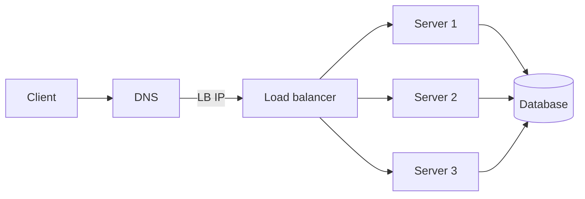
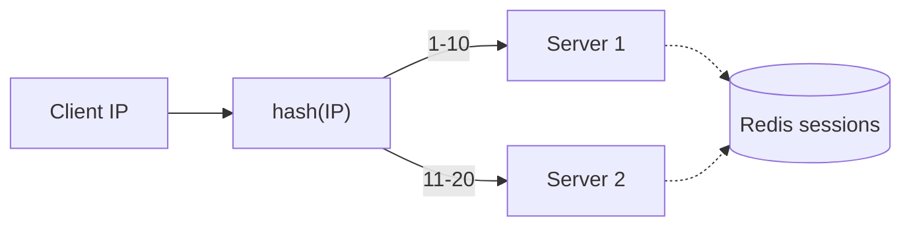
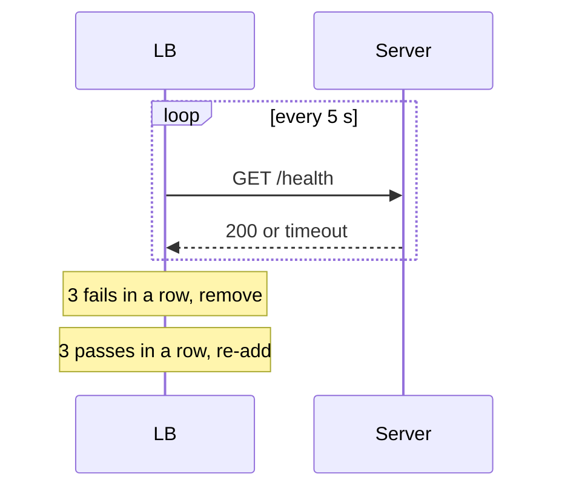

# 🚦 Load balancing

*One server scales only so far; a load balancer spreads requests across many servers and keeps sick ones out of rotation.*

## ❓ Why and where it sits
<!-- related: sd-52, sd-53 -->

### 📈 The ceiling
- Client → DNS → server → DB works until one server saturates.
- Example: already on a **128 GB** machine and still saturated after the app goes global → vertical scaling is out; add S1, S2, S3.
- Now something must decide which server takes each request → **load balancer (LB)**.

### 🗺️ Placement
- DNS returns the **LB's IP**, not a server's.
- LB → S1 / S2 / S3; servers share a DB, or use their own DBs kept in sync via replication / partitioning.

### 🧰 The two jobs
1. **Choose the server** — no server overheated, none idle.
2. **Health checks** — send only to servers that can take the request.

## 🔄 Static algorithms: round robin and weighted
<!-- related: sd-53 -->

### 🔁 Round robin
- Request 1 → S1, 2 → S2, 3 → S3, 4 → S1…
- Needs only a counter: stateless, trivial, equal distribution.
- **Con:** ignores unequal hardware.

| | S1 | S2 | S3 |
|---|---|---|---|
| RAM | 4 GB | 8 GB | 16 GB |
| Storage | 100 GB | 200 GB | 500 GB |
| CPU | 16 core | 32 core | 64 core |

- Equal load → S3 idles while S1 overheats.

### ⚖️ Weighted round robin
- Weight by capacity: S1 **8 GB → 1**, S2 **16 GB → 2**, S3 **32 GB → 3**.
- Requests are spread **in proportion** — per cycle of 6: S1 gets 1, S2 gets 2, S3 gets 3. Not "everything to the heaviest".

> 🔑 Static algorithms suit homogeneous, short, similar-cost requests.

## 📊 Dynamic algorithms: least connections and least response time
<!-- related: sd-53 -->

### 🔗 Least connections
- S1 has **30** open connections, S2 has **50** → next request to **S1**.
- Best for **long-lived connections**: WebSocket chat, video streaming, gaming.
- **Cons:**
  - Heavy and light requests count the same: S1's 30 heavy AI calls vs S2's 50 light REST calls still sends S1 the next one.
  - LB must keep counts current (50 → 49 on each close).
  - Ignores hardware: weak S1 at **8** vs strong S2 at **16** (could take 100) → S1 still wins. Fix: *weighted* least connections.

### ⏱️ Least response time
- S1 averages **50 ms**, S2 **10 ms** over ~1,000 requests → next to **S2**.
- Captures real capability (hardware + current load). Good for latency-critical apps: trading, search.
- **Cons:** LB must track moving averages; spikes skew them — use a decaying (EWMA) average.

> 💡 Long-lived connections ≠ "sticky sessions". Sticky = **session affinity** (IP hash or cookie), a separate concern.

## 🌍 Affinity algorithms: geo and IP hash
<!-- related: sd-51, sd-106 -->

### 🗺️ Geo-based
- S1 in **India**, S2 in **US** — each user goes to the closest region (cross-region hops add latency).
- LB tracks where servers are and where requests come from.
- **Cons:**
  - Regions need their own data → replication / partitioning cost.
  - Failover: if **India-A** fails, **India-B** must already hold A's data — continuous replication, not a copy at failure time.
  - **VPNs and proxies** mislead location.
- Usually done at DNS level (GeoDNS / anycast) in front of regional LBs.

### #️⃣ IP hash
- Hash client IP; S1 owns **1–10**, S2 owns **11–20**; hash 5 → S1.
- Same user → same server, so session stays local.
- **Cons:**
  - Server dies mid-session → user lands on S2 without the session.
  - Adding S3 means re-cutting ranges (e.g. 1–8, 9–12, 13–20) → most users remap.
- Fix for remapping: **consistent hashing** — only ~1/N of keys move.
- Modern default: **stateless servers**, session in a **JWT** or shared **Redis**, so any server can serve anyone.

### 🧬 Hybrids
- Real LBs combine: IP hash + round robin, least time + least connections, geo + weighted.

## 🧱 L4 vs L7
<!-- related: sd-53 -->

| | L4 (transport) | L7 (application) |
|---|---|---|
| Sees | IP + port, TCP/UDP | HTTP path, headers, cookies |
| Can do | Fast forwarding, huge throughput | Path routing, cookie affinity, TLS termination, retries, rate limits |
| Cost | Cheapest, lowest latency | More CPU per request |
| Example | AWS NLB | AWS ALB, NGINX, Envoy |

## 🩺 Health checks
<!-- related: sd-122 -->

### 👀 Passive vs active
- **Passive** — watch real traffic (errors, timeouts). No extra load; detects only after users hit it.
- **Active** — LB sends probes (e.g. `GET /health`). Detects idle failures; adds small load.

### 🚥 Liveness vs readiness
- **Liveness** — is the process alive? Fail → restart it.
- **Readiness** — can it take traffic now (DB reachable, warmed up)? Fail → remove from rotation, don't restart.

### ⚙️ Parameters

| Param | Meaning | Example |
|---|---|---|
| Interval | How often to probe | Every **5 s** |
| Timeout | Max wait per probe | Normal replies **50 ms–5 s**; a sudden **10 s** means investigate (bad deploy, config change, busy server) |
| Unhealthy threshold | Consecutive failures → out of rotation | **2–5** in a row |
| Healthy threshold | Consecutive successes → back in | **2–5** in a row |

- Separate from these: **alerting** thresholds on aggregate counts, e.g. page after **20** failures in a window, or verify output quality every **100** successes. Rotation counts are small and consecutive; alert counts are larger and windowed.

## 📈 Autoscaling
<!-- related: sd-52 -->

- Health and load metrics show the traffic shape: an India-only app is busy by day, peaks in the evening, quiet at night → **scale down at night**.
- Scale on CPU, request rate, queue depth or p90 latency; keep a minimum fleet and a cooldown.
- New instances join only after passing readiness.

