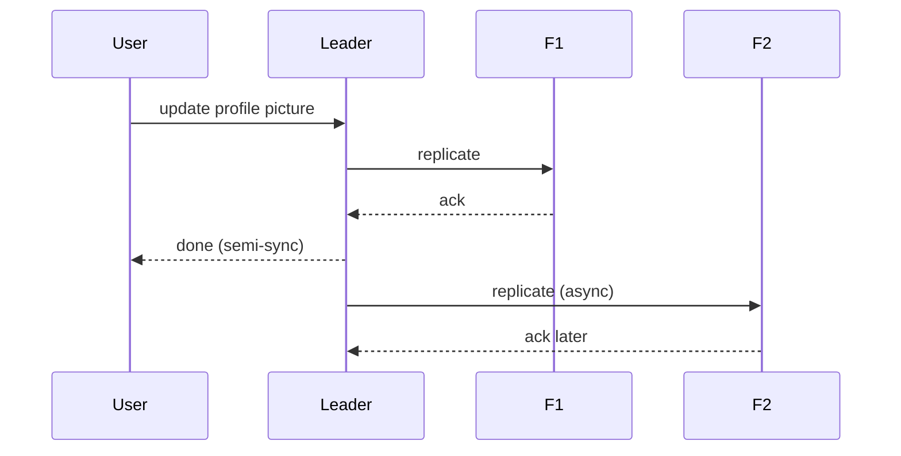
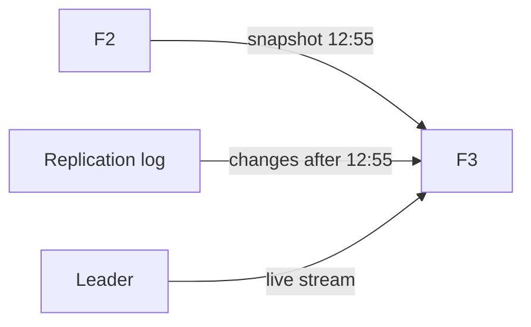
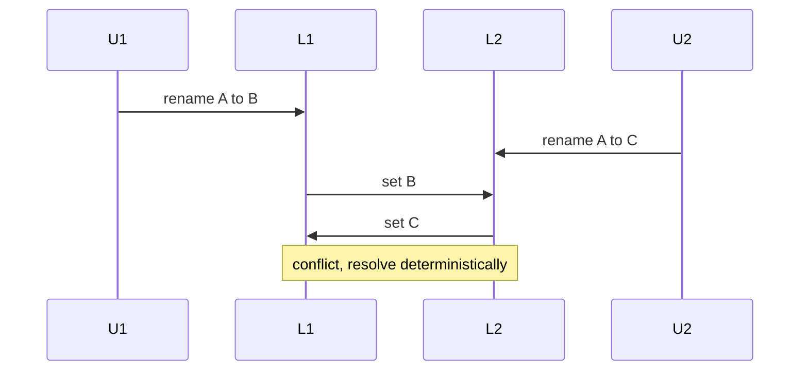
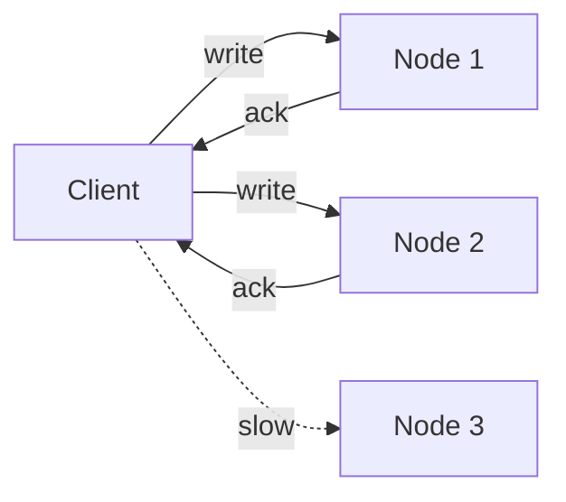

# 🪞 Replication

*Keep copies of the same data on several nodes for failover, locality and read throughput — then manage lag and conflicts.*

## ❓ Why replicate
<!-- related: sd-49 -->

- Eventually one DB can't grow vertically, and one DB can't serve every region well.
- Two ways to distribute: **replication** (copy all data) and **partitioning** (split it). Usually both.

### 🎯 Four reasons
1. **No single point of failure** — survive a DB dying.
2. **Availability** — copies in several data centres.
3. **Latency** — a replica close to each region.
4. **Read throughput** — one DB at **10,000 rps** → two replicas ≈ **20,000 rps** of reads (writes don't scale this way).

## 👑 Single-leader: sync, async, semi-sync
<!-- related: sd-49 -->

- All writes go to the **leader**; followers replay its changes. Reads may go to followers.
- Example: user updates a **profile picture** → server → leader → F1, F2.

### ⚖️ Sync vs async vs semi-sync

| | Sync | Async | Semi-sync |
|---|---|---|---|
| Ack to user | After all followers confirm | Right after leader writes | After leader + **one** follower |
| Latency | Slowest (grows with follower count, distance) | Fastest | Moderate |
| Follower down | Blocks writes | No effect | Another follower takes the sync role |
| Durability on leader loss | No loss | **Can lose** unreplicated writes | At least 2 copies |
| Reads from followers | Always current | May be **stale** | Mostly current |

> 🔑 Fully sync is rarely used across many followers; async or semi-sync is the norm.

## ➕ Adding a follower and failover
<!-- related: sd-49 -->

### 🆕 Adding F3
1. Take a consistent **snapshot** of a node, e.g. F2 at **12:55 pm**, with its position in the replication log.
2. Load it into F3 (can take **2–3 hours** for large data).
3. Apply the **delta** — all changes after 12:55 pm from the replication log.
4. Once caught up, F3 streams from the leader like any follower.

### 🔁 Replication log
- Leader writes each change to a **write-ahead log (WAL)** / binlog; followers replay it in order.
- Snapshot + log position is how you seed replicas and recover.

### 🚨 Failover
1. Detect leader death (heartbeat timeout).
2. Elect the follower with the **most recent log position**.
3. Promote it; repoint other followers and clients.
- **Risks:**
  - Lost async writes the old leader never shipped.
  - **Split brain** — old leader returns and both accept writes. Fix: fencing tokens / epoch numbers, consensus (Raft) for election.

## ⏳ Replication lag anomalies
<!-- related: sd-50 -->

| Anomaly | What the user sees | Fix |
|---|---|---|
| **Read-your-writes** | Updates picture, refreshes, sees old one | Read own data from leader for a short window, or track last-write position |
| **Monotonic reads** | Sees new comment, refresh, it disappears (hit a staler replica) | Pin the user to one replica |
| **Consistent prefix** | Sees an answer before the question | Keep causally related writes in the same partition / order |

## 🌐 Multi-leader
<!-- related: sd-106 -->

- Each data centre has its own leader: **DS1** (L1 + followers), **DS2** (L2 + followers). Leaders replicate to each other.
- **Pros:** local writes in each region, survives a DC loss, offline/collaborative editing (Google Docs style).
- **Con: write conflicts.** U1 via L1 renames file **A → B**; U2 via L2 renames **A → C**; both acked; leaders then exchange conflicting updates.

### 🛠️ Conflict resolution

| Method | How | Trade-off |
|---|---|---|
| Last write wins (LWW) | Latest timestamp wins (C) | Silently drops B; clock skew |
| Higher replica id wins | L1 = 10, L2 = 11 → L2 always wins | Deterministic but arbitrary |
| Ask the user | Show both, like a git merge conflict | Correct, needs UI |
| **CRDTs** / operational transform | Data types that merge automatically | Only for supported types (counters, sets, text) |

## 🕸️ Leaderless and quorums
<!-- related: sd-49, sd-106 -->

- No leader; client (or coordinator) sends writes and reads to several nodes.
- Used by **Amazon Dynamo**, **Riak**, **Cassandra**, **Voldemort**.

### 🧮 Quorum rule
- n replicas, write waits for **w** acks, read queries **r** nodes.
- **w + r > n** → read and write sets overlap, so a read sees the latest write.

| n | w | r | Effect |
|---|---|---|---|
| 3 | 2 | 2 | Balanced; tolerates 1 node down |
| 3 | 3 | 1 | Fast reads; writes fail if any node down |
| 3 | 1 | 3 | Fast writes; slow reads |
| 3 | 1 | 1 | Not a quorum — stale reads possible |

- Example: n = 3, w = 2 → two nodes ack the profile picture, done; the third catches up. Read r = 2 → one fresh, one stale → take the higher **version/timestamp**.

### 🩹 Healing stale replicas
- **Read repair** — on read, push the newest version to stale nodes.
- **Anti-entropy** — background comparison (Merkle trees) to sync.
- **Hinted handoff** — another node holds writes for a down node.

