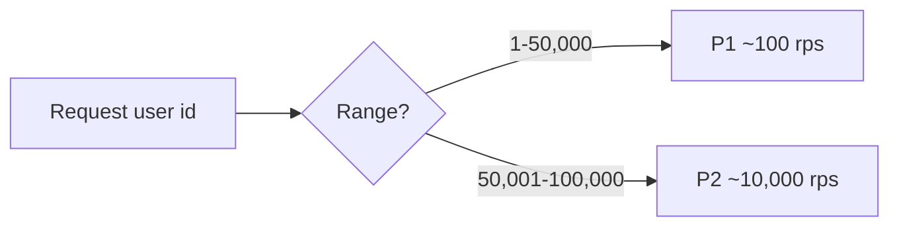
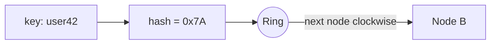
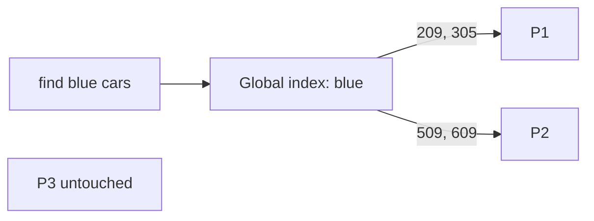

# 🧮 Partitioning

*Split data across nodes (sharding) when it is too big or too hot for one — then replicate each partition.*

## ❓ Why partition, and the two rules
<!-- related: sd-48 -->

### 📦 Why replication isn't enough
- Replication copies **all** data to every node — doesn't help when data outgrows one node.
- Indexes on one huge table still slow down as data grows; writes don't scale.
- Partition first, then **replicate each partition**.
- Example: cap a node at **10,000 records**; beyond that, add a partition or split into 5,000s.

### 📏 Two rules
1. **Complete** — union of all partitions = full data set; nothing lost or duplicated.
2. **Even** — load and data spread evenly; 90% / 10% defeats the point.

## 📐 Key-range partitioning
<!-- related: sd-48 -->

- User ids **1–50,000 → P1**, **50,001–100,000 → P2**.
- ✅ Range scans are cheap (ids 100–200 live together).
- ❌ Skew: if P1 ends up holding India users and P2 US users, and the app is popular in the US → **P1 ~100 rps, P2 ~10,000 rps**.
- **Hot spot** = one partition taking far more load; it can fail and force emergency rebalancing.
- Detect via per-partition request metrics; fix by splitting the hot range.

## #️⃣ Hash partitioning and consistent hashing
<!-- related: sd-51 -->

### 🔢 Hash of key
- `partition = hash(key) mod N` — e.g. hash(user1) = 1, hash(user2) = 2, hash(user3) = 1.
- ✅ Spreads keys uniformly, kills range skew.
- ❌ Range queries hit every partition; changing N remaps almost every key.

### ⭕ Consistent hashing
- Nodes and keys on a hash ring; a key belongs to the next node clockwise.
- Add/remove a node → only ~**1/N** of keys move.
- **Virtual nodes** smooth distribution and let bigger machines take more.

## ⚖️ Rebalancing
<!-- related: sd-48, sd-51 -->

| Approach | How | Note |
|---|---|---|
| Fixed many partitions | Create e.g. 1,000 partitions up front; move whole partitions between nodes | Simple; Elasticsearch, Riak |
| Dynamic split | Split a partition when it grows past a size | HBase, MongoDB |
| Consistent hashing | Ring + vnodes | Cassandra, DynamoDB |

- Move data in the background, throttled; flip routing only after copy completes.
- Keep a routing map (config service / ZooKeeper) so clients find the right partition.

## 🔎 Secondary indexes: local vs global
<!-- related: sd-48 -->

- Single DB: `products(name, color, price, material)` → index `material` so "material = wood" avoids a full scan.
- Partitioned: where does the index live?

### 🏠 Local (document-partitioned) index
- Each partition indexes only its own rows. Cassandra, Elasticsearch.
- P1 holds cars **200–400**, P2 holds **500–700**:

| Colour | P1 index | P2 index |
|---|---|---|
| Blue | 209, 305 | 509, 609 |
| Red | 350, 359 | 610, 690 |
| Silver | — | — |

- "Blue car" → **scatter–gather**: every partition is queried; each answers fast from its index.
- "Silver car" → still sent to **every** partition; each quickly replies "none".
- ✅ Writes are local. ❌ Every read fans out to all partitions.

### 🌐 Global (term-partitioned) index
- One index covering all data, itself partitioned by term: "blue → 209, 305 (P1), 509, 609 (P2)".
- "Blue car" → read the index, then hit **only P1 and P2**; P3, P4… stay free.
- ❌ Writes touch the data partition **and** the index partition. Adding blue car **1011** in **partition 79** also updates the "blue" index entry — usually **asynchronously**, so the index is briefly stale (DynamoDB GSIs).

## 🔥 Hot keys
<!-- related: sd-48, sd-51 -->

- Even perfect hashing can't split **one** key: a celebrity profile, a viral product.
- Mitigations:
  - **Cache** the hot key in front of the DB.
  - **Key salting** — write `key#0..key#9` across partitions, read and merge all 10.
  - Read replicas for the hot partition.
  - Choose a higher-cardinality partition key (e.g. user id + date).

