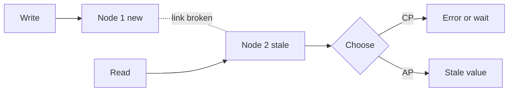
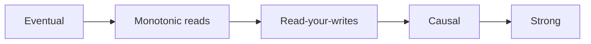

# 🔺 CAP & consistency

*When the network between replicas breaks, a distributed store must choose: refuse (consistent) or answer with possibly stale data (available).*

## 🔤 The three letters
<!-- related: sd-50 -->

| Letter | Meaning |
|---|---|
| **C — Consistency** | **Linearizability**: every read sees the latest completed write, as if one copy existed. Not the "C" of ACID |
| **A — Availability** | Every request to a non-failed node gets a non-error response |
| **P — Partition tolerance** | Keeps working when the **network between nodes drops messages** |

- P is about **network partitions**, not sharding. A single-shard system with two replicas still faces it.
- Example: P1 updated, link to P2 broken, a read hits P2:
  - Choose C → show "loading…" / error until P2 syncs.
  - Choose A → return P2's stale value.

## 🧭 CA, CP, AP
<!-- related: sd-50, sd-106 -->

| Combo | Behaviour | Example |
|---|---|---|
| **CA** | Only possible on a **single node** (no network to partition) | Small app on one DB |
| **CP** | During a partition, out-of-date side refuses or redirects requests | **Banking**: send ₹100; the recipient's view waits until the transfer commits rather than showing a wrong balance |
| **AP** | During a partition, keep serving, reconcile later | **Instagram**: followers see a new photo a second or two late |

- Choice can be **per feature**: payments CP, feed AP.
- Systems: CP — ZooKeeper, etcd, Spanner, HBase; AP — Cassandra, DynamoDB (default), Riak.

## ⚡ PACELC
<!-- related: sd-50, sd-106 -->

- **If Partition**: A or C. **Else** (normal operation): **Latency** or **Consistency**.
- Partitions are rare; the latency/consistency trade is paid on every request (sync replication, quorum reads).

| System | P → | E → |
|---|---|---|
| DynamoDB / Cassandra | A | L |
| Spanner | C | C |
| MongoDB (majority) | C | C |

## 📶 Consistency levels
<!-- related: sd-50, sd-49 -->

| Level | Guarantee | Typical way |
|---|---|---|
| **Strong** (linearizable) | Reads see latest write | Leader reads, sync replication, quorum w + r > n |
| **Read-your-writes** | You see your own writes | Route writer's reads to leader briefly |
| **Monotonic reads** | Never go back in time | Stick a user to one replica |
| **Causal** | Cause seen before effect | Version vectors, same partition |
| **Eventual** | Replicas converge if writes stop | Async replication |

> 🔑 Pick the weakest level the feature tolerates; stronger costs latency and availability.

