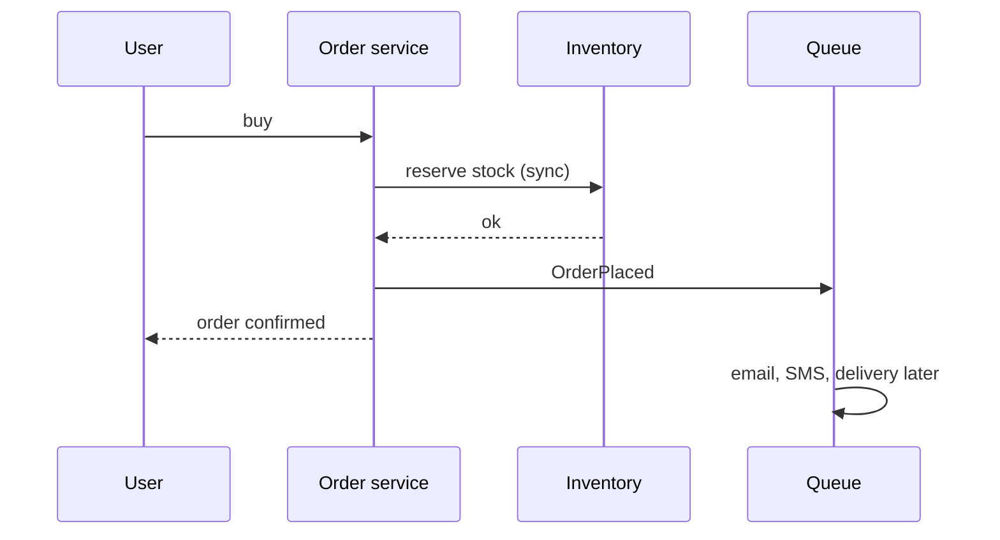
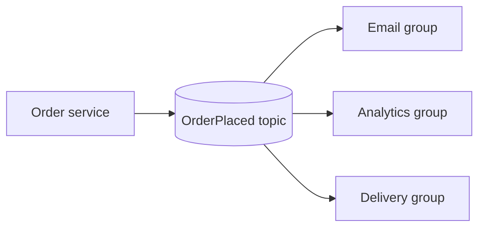
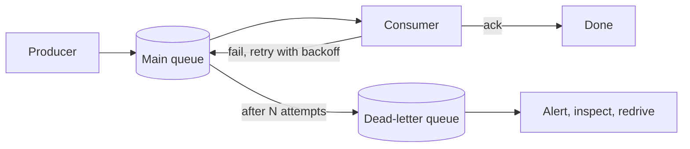

# 📬 Message queues & async

*Do the must-happen-now work synchronously; hand everything else to a queue that buffers, retries and decouples services.*

## ⚖️ Sync vs async
<!-- related: sd-56 -->

### 🛒 E-commerce purchase

| Task | Mode | Why |
|---|---|---|
| Update inventory | **Sync** | Last unit must go out of stock now, or you oversell |
| Order confirmation email | Async | Fine a minute late |
| Notify delivery partner | Async | Separate service's job |
| SMS / WhatsApp | Async | Same |

### 🔒 Keep sync when
- **Financial** steps (charge, balance).
- **Security** checks (auth, fraud gate).
- **Dependent** steps — the email can't go before the order is confirmed; it's async relative to the user, but after the commit.

### 🔥 Fire-and-forget → async
- Broadcasts: live match streams lag **0–10 s** and nobody minds.
- Email, SMS, WhatsApp.
- **OTP**: timers are **30 s+** because delivery is async.

## 🧩 Producer, consumer and why a queue
<!-- related: sd-56, sd-65 -->

- **Producer (publisher)** puts messages in; **consumer (subscriber)** takes them out; broker sits between.
- Why not call the email service directly? Your request thread waits, and you must handle its outages yourself.

### ✅ Qualities
1. **Holds** messages durably (buffer).
2. **Delivers** them to consumers.
3. **Retries** failures.
4. **Levels load** — consumers work at their pace during spikes.

### 🔀 Point-to-point vs pub/sub

| | Point-to-point (work queue) | Pub/sub (topic) |
|---|---|---|
| Each message goes to | **One** consumer of the group | **Every** subscribing group |
| Use | Spread jobs across workers (competing consumers) | Fan out an event: email, analytics, search index |
| Examples | SQS, RabbitMQ queue | Kafka topic with groups, SNS, RabbitMQ fanout |

## 🔢 Ordering and priority
<!-- related: sd-56 -->

### ➡️ FIFO
- **Strict FIFO:** 1 ✓, 2 ✓, 3 fails → the queue **blocks**; 4 waits even after the consumer recovers. Avoid unless order truly matters.
- **Unordered / best-effort:** 3 fails → move on to 4, retry 3 separately (DLQ).
- Global order is expensive; use **per-key ordering** — Kafka partitions by key (e.g. order id), so one order's events stay ordered while different orders run in parallel.

### ⭐ Priority queue
- Each message has a priority; here 1 = most important.
- Messages 1st = **10**, 2nd = **3**, 3rd = **8**, 4th = **1** → processed **4, 2, 3, 1**.
- Risk: starvation of low priority; add aging or separate queues per priority.

## 📥 Pull vs push
<!-- related: sd-56 -->

| | Pull | Push |
|---|---|---|
| Who starts | Consumer asks when free | Broker sends to consumer |
| Backpressure | Natural — consumer takes what it can | Needs prefetch limits / acks |
| Examples | **Kafka**, **SQS** | **RabbitMQ**, **SNS**, webhooks |

## ☠️ Failures: poison messages, DLQ, idempotency
<!-- related: sd-56, sd-65 -->

- **Poison message** — can never succeed (malformed, invalid). Retrying forever wastes consumer and broker capacity and can block a strict queue.
- **DLQ (dead-letter queue)** — after N retries (with backoff), move it aside; main flow continues. Alert on DLQ depth; inspect, fix, **redrive**.
- **At-least-once delivery** — consumer does the work, crashes before acking, message is redelivered. Duplicates are normal; exactly-once is not free.
- **Idempotent consumers** — dedupe on a message / idempotency key (store processed ids), or make writes naturally idempotent (upsert, `SET status = shipped`).

## 🎯 When to use and when to avoid
<!-- related: sd-56, sd-59 -->

### ✅ Use for
- Async work: notifications, emails, image/video processing.
- **Decoupling** — analytics events, log pipelines, event-driven services.
- **Load levelling** — absorb spikes; competing consumers share async work (they don't route sync client requests — that's the LB's job).
- **Deferred / scheduled** jobs — daily reports; catalogue edits all day, publish in the evening.

### ❌ Avoid when
- **Low volume** — a broker adds cost and ops; call directly.
- **Real-time response** needed — the caller would just wait.
- Caller needs a **per-request result** now — use a sync call (or request/reply with a callback).

