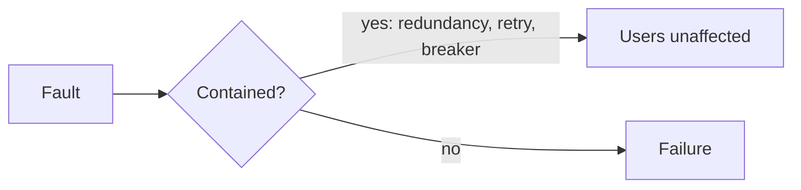
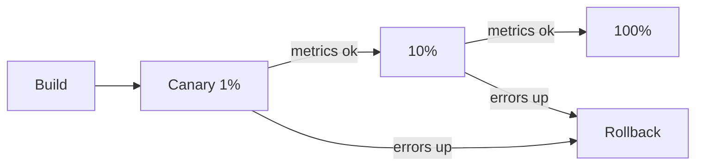
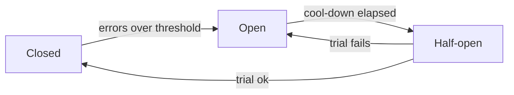

# 💥 Faults & reliability

*Faults are inevitable; reliability is stopping a fault in one component from becoming a failure users see.*

## 🔤 Fault vs failure
<!-- related: sd-123 -->

- **Fault** — one component deviates from spec (a disk dies, a bug throws).
- **Failure** — the system as a whole stops serving users.
- **Fault tolerance** — design so faults don't become failures.

| Kind | Nature | Main defence |
|---|---|---|
| Hardware | Random, independent | Redundancy |
| Software | Deterministic, **correlated** | Testing, staged rollouts, isolation |
| Human | Unpredictable, leading outage cause | Guardrails, automation, review |

## 🖥️ Hardware faults
<!-- related: sd-123 -->

- Causes:
  - disk full;
  - out of memory;
  - server down;
  - damaged network cable;
  - power supply issue;
  - misconfigured node;
  - traffic spike → overheating;
  - compromised database.
- **Random and independent** — one disk's death says little about another's.
- Mitigation:
  - **Redundancy** — N+1 servers, replicated DBs, multi-AZ.
  - Alerts on leading signals (disk 85%, memory 90%).
  - Automatic replacement (autoscaling groups, orchestrators).

## 🐛 Software faults
<!-- related: sd-123 -->

- Causes:
  - bad code, unhandled exceptions;
  - edge cases that only real users hit;
  - configuration errors (service, API config);
  - **environment drift** — dev ≠ staging ≠ prod;
  - **merge conflicts** — two developers change the same feature in parallel;
  - performance regressions (slow requests).
- **Deterministic** — same input, same crash; reproducible, so fixable, but it keeps recurring until fixed.
- **Correlated** — the same bug runs on every node, so redundancy doesn't help; all replicas crash together.
- Mitigation:
  - Handle exceptions; test edge cases; test every component on every build.
  - Infrastructure/config as code; parity between environments.
  - Staged rollouts, feature flags, fast rollback.

## 🧑 Human faults
<!-- related: sd-123 -->

- Humans are the least predictable component and a leading cause of real outages (bad config push, wrong command).
- Also the most important: someone must be accountable. AI-generated code still needs human **review and ownership**.
- Mitigation:
  - **Guardrails** — reviews, CI checks, restricted prod access, confirmation on destructive ops.
  - Automation over manual runbooks.
  - **Blameless postmortems** → fix the root cause everywhere, not a band-aid.
  - Easy rollback, sandboxes for trying things.

## 🚀 Safe rollouts
<!-- related: sd-123 -->

- **Canary** — 1% → 10% → 50% → 100%, gated on error rate and p99.
- **Blue/green** — switch traffic between two environments; instant rollback.
- **Feature flags** — ship dark, enable gradually, kill switch.

## 🔌 Circuit breakers and graceful degradation
<!-- related: sd-60 -->

- A slow dependency ties up threads upstream → **cascading failure**.
- **Timeouts** on every remote call; **retries** with backoff + jitter, capped.
- **Circuit breaker** — Closed (normal) → Open after error threshold (fail fast) → Half-open (trial calls) → Closed.
- **Bulkheads** — separate pools per dependency.
- **Fallbacks** — cached data, default response, hide the feature.

## 🐒 Chaos testing
<!-- related: sd-123 -->

- Inject faults on purpose (kill instances, add latency, drop a zone) to prove fault tolerance works.
- Start in staging, small blast radius, with a stop button; then game days in prod.
- Examples: Chaos Monkey, fault injection in the service mesh.

