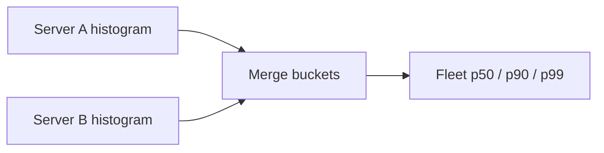
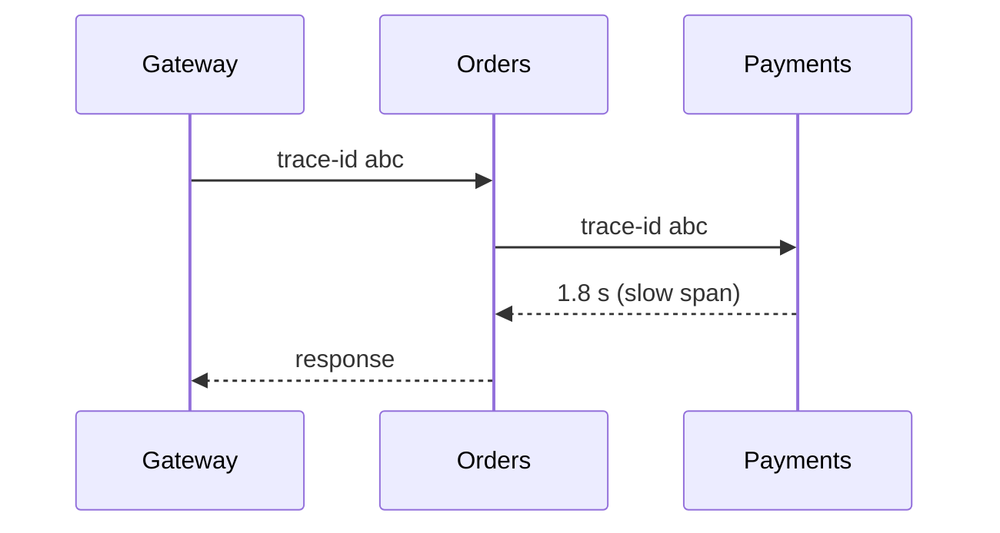

# 📈 Monitoring & observability

*Once shipped, the job is knowing — before users do — whether every API and machine is healthy, and being able to trace why when it isn't.*

## ❓ What maintenance must answer
<!-- related: sd-122 -->

- Are there errors, and are they recorded?
- Is every server, DB and queue **healthy**?
- Can each customer request be **traced** through logs?
- Can we reach the **root cause (RCA)** fast?
- If a component dies, does something take over?
- Do **alerts** fire before it becomes an incident?

### 🧭 Two things to watch
- A service handles requests itself or forwards them to others → monitor **APIs** (what users feel) and **machines** (why).

### 🚦 Four golden signals

| Signal | Question | Example metric |
|---|---|---|
| **Latency** | How slow? | p50 / p90 / p99 per endpoint |
| **Traffic** | How much? | Requests per second |
| **Errors** | How often wrong? | 5xx rate, failed jobs |
| **Saturation** | How full? | CPU, memory, queue depth |

## 🌐 API monitoring: throughput, errors, health
<!-- related: sd-122 -->

### 📊 Throughput
- Server tested to **10k rps** → alert at **8–9k** and shift or scale traffic before it tips over.

### ❌ Error codes
- Track counts and **rates** of **5xx** (our fault — page), **4xx** (client/bad release of clients — watch spikes), **3xx** (unexpected redirects).
- Alert on rate over threshold; logs must carry enough context to find the RCA.

### 🩺 Health
- Active probes and passive signals; count successful **200**s too — a drop in success volume is also a signal.

## ⏱️ Latency percentiles
<!-- related: sd-122 -->

### 🔢 Worked example — 10 responses (seconds)
Sorted: **1, 2, 3, 3, 4, 5, 6, 8, 12, 24**

| Stat | Value | Reading |
|---|---|---|
| Average | **6.8 s** | Dragged up by the tail; matches almost no real request |
| p50 (5th value) | **4 s** | Half finish within 4 s |
| p90 (9th value) | **12 s** | 90% finish within 12 s; 1 in 10 is slower |

- Large **p50 → p90 gap** → a slow subset; find the endpoints near 12 s and optimise them.
- Big systems watch **p99 / p99.9** — at millions of requests, 0.1% is thousands of users, often the heaviest ones.
- Alert on outliers: with p90 at 12 s, a **50 s** response is abnormal → alert / investigate.

> 🔑 Never average percentiles across servers or time windows — the mean of p99s is not the fleet p99. Merge histograms (or t-digests), then compute.

## 🖥️ Machine monitoring
<!-- related: sd-122 -->

| Metric | Example alert | Action |
|---|---|---|
| CPU | **75%** sustained (70 or 90 also common) | Scale out, profile hot paths |
| Memory | **90%** used | Scale, check for leaks |
| Disk I/O | Over a set limit | Check slow queries, compaction |
| Network I/O | Over a set limit | Check payload sizes, add capacity |

- Also: disk space, open file descriptors, GC pauses, queue depth / consumer lag.

## 🔍 Logs, traces and RCA
<!-- related: sd-99, sd-122 -->

| Pillar | Answers | Tip |
|---|---|---|
| **Metrics** | Is something wrong? | Cheap, aggregated, alert on these |
| **Logs** | What exactly happened? | Structured JSON, request id, no secrets / PII |
| **Traces** | Where in the call chain? | Propagate a trace id across services |

- RCA flow: alert on metric → narrow via dashboard → trace a slow request → read its logs.

## 🚨 Alerting tiers
<!-- related: sd-122, sd-99 -->

| Tier | Trigger | Route |
|---|---|---|
| **Page** | User-facing SLO burn (5xx rate, p99 breach, outage) | On-call, now |
| **Ticket** | Trending risk (disk 80%, cert expiring) | Next business day |
| **Dashboard / log** | Informational | No notification |

- Alert on **symptoms** users feel, not every cause; use windows ("5 min over threshold") to avoid flapping.
- Every page must be actionable and linked to a runbook.

