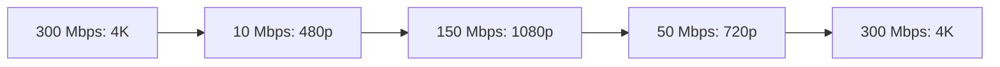
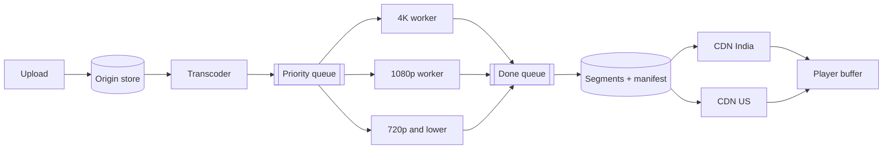

# 🎬 Video streaming (worked example)

*Cut every video into short segments at several qualities, push them to CDN edges, and let the player pick the quality its network can sustain, segment by segment.*

## 🎯 Scope and what a video is
<!-- related: sd-68, sd-17 -->

### 📌 Scope
- Examples: YouTube, Hotstar, Netflix, Prime; LMS platforms; calls (Meet, Zoom) are a separate, real-time case.
- Out of scope: login, reviews, ratings. In scope: **how a video gets from storage to the viewer's screen**.

### 🖼️ Frames and FPS
- Video = sequence of images (**frames**) + audio.
- **FPS:** 30 and 60 common; 120 and 240 exist. 30 fps → 30 images per second; 60 fps → 60, smoother but bigger.

### 📦 Sizes
| Recording (1 hour) | Size | Rate |
|---|---|---|
| Talking-head HD, 30 fps | ≈ **2 GB** | ≈ **0.57 MB/s** |
| Same in 4K | ≈ 4 GB | ≈ 1.1 MB/s |
| Multi-camera 4K | ≈ 8 GB | ≈ 2.2 MB/s |
| Outdoor / action 4K | ≈ **16 GB** | ≈ **4 MB/s** (~36 Mbps) |

- Motion and colour kill compression: a static board compresses far better than sport.
- 4 MB/s on a weak or fluctuating network → buffering → viewers leave.

## 🧩 Segments, protocols and the rendition ladder
<!-- related: sd-68, sd-17 -->

### ✂️ Why segments
- Downloading the whole 2 GB first → long wait, and wasted data if the viewer quits after 10 s.
- Split into **segments** (typically 2–10 s); the client **pulls** them one by one, keeping a few buffered ahead.
- Start fast, seek anywhere, never fetch what isn't watched.

### 📡 Protocols
| Use | Protocol | Transport |
|---|---|---|
| Viewer playback (VOD, most live) | **HLS** / **MPEG-DASH** — segments + **manifest** listing renditions | HTTP over TCP → CDN-cacheable |
| Ingest (broadcaster → platform) | **RTMP** (or SRT) | TCP |
| IP cameras | RTSP | — |
| Calls, sub-second live | **WebRTC** | UDP |

### 🪜 Rendition ladder and devices
- Renditions: **4K, 1080p, 720p, 480p, 240p, 144p**. Lower → smaller segments → faster to load.

| Device | Sensible cap |
|---|---|
| TV | 4K |
| Laptop | 1080p–4K by screen and network |
| Phone | 1080p (4K is wasted) |
| Tablet | 1080p |
| Watch | 480p |

## 📶 Adaptive bitrate (ABR)
<!-- related: sd-17 -->

- Every segment exists at every rendition; the player chooses per segment.
- **Rule:** measured throughput comfortably **above** the next rendition's bitrate → step **up**; **below** the current bitrate or buffer draining → step **down**. Already-buffered segments keep playing at their quality.

| Network | Next segments load at |
|---|---|
| **300 Mbps** | **4K** |
| Drops to **10 Mbps** | **480p** (buffered 4K segments still play) |
| Back to **150 Mbps** | **1080p** |
| Drops to **50 Mbps** | **720p** |
| Back to **300 Mbps** | **4K** |

- Real players step up gradually and use buffer level too (avoid oscillation). The quality menu offers **Auto** (ABR) or a pinned rendition.

## 🏗️ Pipeline: upload to player
<!-- related: sd-68, sd-54 -->

1. Creator **uploads** the master → **origin object store**.
2. **Transcoder / segmenter** splits it into segment jobs.
3. **Priority queue** — e.g. popular creators or live events first; retries.
4. **Workers per rendition** (4K, 1080p, 720p…) encode in parallel.
5. Results → a completion **queue** → write segments + manifest to origin.
6. **CDN edges per region** (India, US, …) pull and cache segments.
7. **Player** fetches manifest, then segments via ABR; its **buffer** caches upcoming segments.

### 🗄️ Caching layers
- **CDN edge** — hot segments near viewers; origin sees only misses.
- **Player buffer** — next few segments ahead.

## 🧮 Back-of-envelope
<!-- related: sd-68, sd-54 -->

### 📼 Storage for one video
- Master: **20-min 4K 60 fps ≈ 50 GB** (~330 Mbps — a production master, not what viewers stream).
- **1,200 s → 1,200 one-second segments.**

| Rendition | Total | Per 1-s segment |
|---|---|---|
| 4K | 50 GB | ~41.67 MB |
| 1080p | 20 GB | ~16.6 MB |
| 720p | ~10 GB | ~8.3 MB |
| 480p | ~5 GB | ~4.17 MB |
| 240p | ~2.5 GB | ~2.08 MB |
| **All renditions** | **~87.5 GB** | ~72.65 MB (sum across renditions) |

- **87.5 GB is storage per video**, independent of viewer count.
- A viewer downloads **one** rendition per segment: ~2 MB (240p) to ~42 MB (4K) per second at these master-grade sizes.
- Delivered 4K is typically **~15–25 Mbps** after proper encoding (H.264/HEVC/AV1), not 330 Mbps.

### 📡 Bandwidth
- **Egress = concurrent viewers × bitrate.**
- 100 viewers × 20 Mbps (4K) = **2 Gbps**; 100,000 × 20 Mbps = **2 Tbps**.

## 📈 Scaling from 100 to 100,000 viewers
<!-- related: sd-54, sd-68, sd-110 -->

| Viewers | Egress (4K ~20 Mbps) | Design |
|---|---|---|
| 100 | ~2 Gbps | One origin + small CDN footprint works |
| 100,000 | ~2 Tbps | Multi-region CDN edges, origin shield, multiple origins |

- Storage doesn't change with viewers; **edges and connections** do.
- Add: origin shield (one mid-tier cache in front of origin), pre-warm edges for launches, per-region transcoding capacity, queues to absorb upload spikes.
- Most viewers watch at 720p–1080p on phones, so average bitrate is far below 4K.
- Offline downloads reuse the same segments + DRM licences.

