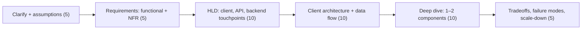

# 📱 Mobile System Design Round

*Designing a mobile app or client library end to end. Covers what's evaluated, the device constraints to design against, a structure for the hour and the building blocks most answers reuse.*

## 🎯 What is evaluated
<!-- related: sd-1, sd-2 -->

- **Platform domain knowledge** — threads and scheduling, services, lifecycle, storage, architecture components, profiling tools.
- **Design skill at both levels**:

| | High-level design (HLD) | Low-level design (LLD) |
|---|---|---|
| Question | Which components, how data flows | How one component works inside |
| Artifacts | Client ↔ backend diagram, API, sync strategy | Classes, interfaces, threading, cache policy |
| Example | Feed: API, pagination, cache, push | Image cache: LRU sizing, eviction, key scheme |

- **Tradeoff analysis** — compare options and say *why* one wins given battery, network and memory.
- **Ambiguity handling** — state assumptions out loud; they are expected, not optional.
- **Built-in qualities** — reusable components, accessibility and privacy from the start, bottlenecks named before they're asked about.
- Coding here is light — more "how do you run parallel jobs on a low-memory device?" than a full implementation.

## ⚖️ Constraints to design against
<!-- related: sd-29, sd-117 -->

| Constraint | Design response |
|---|---|
| **Battery** | Batch network, push over polling, defer with OS schedulers, coarse location |
| **Network** | Offline-first, retries with backoff, small payloads, delta sync, compression |
| **Memory** | Bounded caches and pools, downsampled images, paging, stream large files |
| **Device diversity** | Test and budget for low-end CPU/RAM; adaptive quality; multiple screen sizes |
| **Connectivity** | Local source of truth, outbox queue, clear sync status, resumable transfers |
| **Compute** | Move heavy work to the server or off-peak; limit parallelism |
| **Storage** | Quotas, eviction, user-clearable caches |
| **OS lifecycle** | Process death, background limits, Doze — nothing assumed to keep running |

> 🔑 Every choice should answer: what happens on a cheap phone, on a train, with 5% battery?

## 🗺️ Structure for the answer
<!-- related: sd-1, sd-18 -->

1. **Clarify** — users, platforms, online/offline expectations, scale, what's out of scope.
2. **Requirements** — core features; NFRs: latency, offline, battery, privacy, accessibility.
3. **HLD** — client ↔ API contract (REST/GraphQL/WebSocket), push, CDN for media.
4. **Client architecture** — UI → ViewModel → repository → local DB (source of truth) + remote.
5. **Deep dive** — the hardest part: sync engine, image pipeline, real-time channel, pagination.
6. **Wrap up** — tradeoffs, bottlenecks, monitoring, rollout, what you'd do with more time.

## 🧱 Common building blocks
<!-- related: sd-3, sd-18, sd-113, sd-114, sd-116 -->

| Block | Key decisions |
|---|---|
| **Offline-first sync** | Local DB as truth, outbox queue, conflict policy (last-write-wins / merge / app rules), sync status UI |
| **Image loading** | Memory LRU + disk cache, downsampling, placeholders/errors, request de-dup, cancel on scroll |
| **Pagination** | Cursor-based API, prefetch distance, DB-backed paging |
| **Real-time** | WebSocket / long-poll while foreground; push when background; reconnect with backoff |
| **Push notifications** | Device token registry, per-device vs topic targeting, channels, data vs notification messages |
| **Deep linking** | Verified app links, deferred deep links through install, routing at the navigation host |
| **Networking layer** | Interceptors (auth, logging), retries with idempotency keys, caching headers |
| **Background work** | Constrained, persisted jobs; foreground service only for user-visible work |
| **Startup** | Lazy init, cached first screen, baseline profiles, tracing |
| **Modularization** | Feature + core modules, dynamic delivery for rarely used features |
| **Testing** | Unit / integration / UI pyramid — fidelity vs speed |
| **Observability** | Crash + ANR rates, perf traces, feature flags, staged rollout |

## 🧪 Typical prompts
<!-- related: sd-2, sd-30, sd-119, sd-117, sd-118 -->

- Apps: messaging/chat, photo feed with stories, music streaming, ride hailing, location sharing, video calling.
  - 💬 Messaging: [Design a real-time Messaging System | Walmart](https://codemia.io/practice/walmart-design-a-real-time-messaging-system), 🎥 [Design WhatsApp](https://youtu.be/RJRPTfI7l5Q), [chat app](https://blog.algomaster.io/p/design-a-chat-application-like-whatsapp)
  - 📸 Stories: 🎥 [Design Instagram Stories](https://youtu.be/N5zXmp2FJgc)
  - 🎵 Music: 🎥 [Design Spotify](https://youtu.be/XTFRUtQwwUw)
  - 🚗 Ride hailing: 🎥 [Design Uber](https://youtu.be/2Ju_7uphfBc)
  - 🔗 Classic backend warm-up: 🎥 [Design URL Shortner Service](https://youtu.be/uL5pSfYYspg)
- Libraries: image loader, file downloader, networking client, analytics SDK, caching library.
- Production: "the app crashes for a slice of users — how do you find and contain it?" → segment by version/OS/device, kill switch, fix, staged re-rollout.

- Practice banks: [Codemia | Master System Design Interviews Through Active Practice](https://codemia.io/?via=javarevisited), [Awesome System Design Resources](https://github.com/ashishps1/awesome-system-design-resources).

> 📝 Practice: design an analytics SDK — batching, persistence across process death, sampling, battery and privacy limits.
