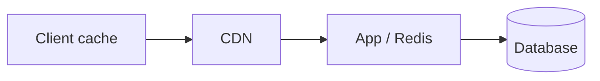

# Concept note format

## Rules

| Element | Syntax | Rendered as |
|---|---|---|
| Title | line 1: `# <emoji> <Title>` then a 1–2 line *italic* summary | note header |
| Section | `## <emoji> <title>` | one card in the detail pane (the note itself is one feed card) |
| Section related ids | `<!-- related: sd-45, sd-54 -->` directly under the H2 | chips; else registry `related` |
| Subsection | `### <emoji> <subtitle>` | heading inside its section card |
| Flow | ```` ```mermaid ```` block | diagram (click to enlarge) |
| Comparison | Markdown table | table |
| Callouts | `> 💡` tip · `> 🔑` rule · `> 📝` practice | quote block |
| Reference link | inline `[Room](https://…)` where the term appears; practice problems as `> 📝 Practice: [Two Sum](https://…)` | opens in a new tab with ↗ |

Registry entry (`data/notes.js`):

```javascript
NotesDB.register([
  { id: 'caching', topic: 'system-design', title: 'Caching', icon: '⚡',
    file: 'data/notes/system-design/08-caching.md', related: ['sd-12'] },
]);
```

Ids are kebab-case and unique across all topics. Files are `<NN>-<id>.md`: `NN` is the note's 1-based position within its topic in `data/notes.js` (the feed card order), zero-padded; adding or reordering notes means renumbering files to match.

## Example note

````markdown
# ⚡ Caching

*Keep hot data close to the reader. Covers where caches sit and how they stay correct.* (This summary line is shown on the note's feed card.)

## 🧭 Cache placement
<!-- related: sd-12, sd-30 -->

### 🗺️ Layers



Each hop that answers saves every hop behind it.

> 🔑 Cache as close to the reader as correctness allows.

### 📊 Where to cache

| Layer | Latency | Best for |
|---|---|---|
| Client | ~0 ms | per-user, static assets |
| CDN | 10–50 ms | public, cacheable responses |
| Redis | ~1 ms | shared hot keys |


## 🔄 Invalidation

### ✍️ Write strategies

- **Cache-aside** — app reads cache, falls back to DB, then fills.
- **Write-through** — write both synchronously; fresher, slower writes.

> 💡 A TTL is the safety net even when you invalidate explicitly.

> 📝 Practice: design invalidation for a profile page edited by its owner.

````

## Emoji vocabulary

Fixed (do not substitute):

| Emoji | Meaning |
|---|---|
| 💡 | tip callout |
| 🔑 | rule callout |
| 📝 | practice callout |
| 📚 | Notes (app UI) — not for headings |

Suggestions for titles and sections:

| Use | Emoji |
|---|---|
| Android topic / platform | 🤖 📱 |
| Kotlin / language | 🟣 |
| Concurrency / coroutines | 🧵 🔀 |
| Lifecycle / state | ♻️ 🧩 |
| UI / Compose | 🎨 |
| Performance | ⚡ 🚀 |
| Behavioral / leadership | 🧑‍🤝‍🧑 🧭 |
| Conflict / feedback | 🤝 💬 |
| Data structures | 🧱 🌳 🔗 |
| Algorithms / complexity | ⏱️ 🧮 |
| System design / architecture | 🏗️ 🗺️ |
| Storage / databases | 🗄️ |
| Networking / APIs | 🌐 🔌 |
| Scaling / reliability | 📈 🛡️ |
| Trade-offs / comparisons | ⚖️ 📊 |
| Definitions / overview | 📖 🧭 |
| Steps / how-to | ✍️ 🪜 |
| Pitfalls | 🚩 ⚠️ |
